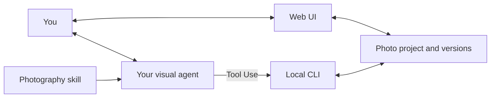

# Frameyn · 帧映


**A photography workspace for people and agents.**

Frameyn combines a **Web UI, a photography agent skill, and local pixel tools**. Edit light and color, try styles, crop, inspect details, and export in your browser. Or ask your existing visual agent to review the image, explain tradeoffs, and create candidates, then return to the same darkroom to refine them.

Photographs, intent, annotations, and versions live in local projects. Manual choices and agent tool calls work with the same project records.

[简体中文](README.md) · [Web UI](#use-the-web-ui) · [Agent skill](#use-the-agent-skill) · [Screenshots](#screenshots) · [Tool reference](skills/guangjian-retouch/references/tools.md)

## Two ways to use Frameyn

| Entry point | Experience | Start |
| --- | --- | --- |
| **Web UI · edit yourself** | Inspect photographs, adjust controls, try styles, crop, and export in a local darkroom. Works independently, without an agent. | [Start the darkroom](#use-the-web-ui) |
| **Agent skill · edit together** | Your visual agent reviews the image and calls tools. Use the Web UI to compare candidates, annotate regions, and refine the result. | [Install the skill](#use-the-agent-skill) |

Both use the local pixel engine and project records. With an agent available, switch between them: after a manual edit, ask it to read the current result; after saving annotations, ask for advice about those specific regions.

## From understanding a photograph to choosing a version

| Step | What you can do |
| --- | --- |
| **Review** | Examine subject, background, light, composition, visual order, and mood. A photograph that already works can receive a recommendation to keep it as it is. |
| **Preview** | Create candidates around an intent such as natural skin tones or a quiet morning atmosphere. Inspect actual results and their tradeoffs. |
| **Refine** | Compare with the original, inspect at 100%, zoom and pan, adjust controls, or annotate a region in the local darkroom. Ask your agent to read the latest comments and continue. |
| **Choose** | Accept or discard candidates, save named versions such as “Natural” or “Film,” restore an earlier version, and export. |

Candidates start from the current version. Global controls, styles, and local adjustments have distinct processing layers. Original image bytes are stored separately; previews and discarded candidates leave accepted versions intact.

## Screenshots

### Manual retouching in the Web UI

The photograph occupies the main workspace. The inspector holds intent, controls, styles, and cropping, with viewing and export actions nearby.


<details>
<summary>View annotations, candidate comparison, and export</summary>

**Mark a region and explain.** Each annotation keeps its own region and comment. The agent reads all the latest annotations from the project. Discussion markers and accepted pixel adjustments are stored separately.


**Compare before accepting.** The current version and candidate share position, framing, and magnification. Inspect the overall composition or zoom into detail; existing versions stay intact until a candidate is accepted.


**Export for the intended use.** Sharing, printing, and original-size presets work with format, size, and quality controls. Export uses a saved version.


</details>

These are actual screenshots of the local Web UI using the product's built-in demonstration image. The candidate illustrates a small adjustment. [Capture notes and reproduction](docs/SCREENSHOTS.md)

## Use the Web UI

You need **Node.js 20.9+** and a modern browser. Choose a photograph and initialize a project from the command line once, then work in your browser. No agent or model API key is required for manual editing.

```sh
git clone https://github.com/GeminiLight/frameyn.git
cd frameyn
npm run setup
mkdir -p projects

node skills/guangjian-retouch/scripts/cli.mjs init \
  --image "/your/photo.jpg" \
  --project "./projects/my-photo" \
  --intent "Preserve natural colors and the existing light"

node skills/guangjian-retouch/scripts/cli.mjs serve \
  --project "./projects/my-photo"
```

Open the local URL printed by the terminal. Adjust controls, style, or crop, then select **生成试片** (Create trial), inspect the comparison, and **接受这版** (Accept) or **取消试片** (Discard). Export after accepting. The local interface is currently in Chinese.

The project directory must be new; the original is stored separately. Press `Ctrl+C` to stop the server. Run `serve` again for the same project to restore photographs, annotations, and saved versions without repeating `init`. The examples use macOS / Linux shell syntax.

### Online studio preview

A separately deployed [Web studio preview](https://ai-photography-preview-geminilights-projects.vercel.app/) offers browser uploads, multiple photographs, diagnosis, and an integrated advisor. It currently requires access through Vercel deployment protection. Check the page for the current visual-model connection status.

This repository distributes the local Web UI, skill, and CLI. The separate online application's deployment source is not included yet. Its browser drafts do not automatically synchronize with local photo projects.

## Use the agent skill

You need **Node.js 20.9+** and an agent that can read images, run local tools, and load skills, such as Codex.

### 1. Install

```sh
git clone https://github.com/GeminiLight/frameyn.git
cd frameyn
npm run install:skill
```

The first installation prepares pinned Sharp and native Canvas dependencies. The default destination is `~/.codex/skills/guangjian-retouch`. Reload your host's skill list or start a new task if the skill has not appeared yet.

> **Installation identifier:** the brand and repository are now Frameyn. The skill keeps `guangjian-retouch` for compatibility with existing installations and invocations. The examples below use this working identifier.

### 2. Bring a photograph and an intent

Send this to your agent, replacing the path with your photograph:

```text
Use $guangjian-retouch on /photos/morning.jpg.
Keep the quiet morning atmosphere and natural colors. Review the image first
and explain what is worth preserving. Make changes only when they offer a
clear benefit, and show me candidate previews before accepting them.
```

Your agent reads the image and relevant photography knowledge, creates a local photo project, and returns review observations or candidates. Ask it to open the local darkroom to inspect, annotate, and refine.

### 3. Continue from annotations

Mark regions and save your comments, then return to your agent:

```text
Read all the annotations I just saved.
Make the person a little clearer while keeping the background quiet.
Preserve the warm light I marked. Work from the current version,
explain the changes and tradeoffs, and let me compare the candidate first.
```

Conversation happens in your host agent. The local darkroom provides viewing, annotation, and retouching controls. The agent reads updated annotations when continuing a task; the page does not contain a separate chat model.

<details>
<summary>Update an existing skill or install into another host</summary>

Updates back up the previous skill first:

```sh
npm run install:skill -- --update
```

Choose another compatible host's skill directory:

```sh
node scripts/install-photo-skill.mjs /your/skills/guangjian-retouch
```

The skill includes an independently runnable local Web UI and tools. No additional model service deployment is required. Cloning a private repository requires a GitHub account with access.

</details>

## Photography knowledge

Frameyn loads knowledge for the current subject and task: **79 sections, 10 subject and scene playbooks, 14 style presets, and learning references from 10 photographers**.

The guidance explains when a treatment helps and what it costs. A backlit portrait needs a readable subject while preserving the backlight relationship. A style should suit the existing light, subject, and intent. References to Hideaki Hamada, Saul Leiter, Rinko Kawauchi, and others guide observation; photographer names do not imply official presets, licensed recipes, or exact reproductions.

<details>
<summary>Explore the knowledge map</summary>

Reference documents are currently written in Chinese; your host agent can use them in a conversation in your preferred language.

| Question | Reference |
| --- | --- |
| What should change, and what should stay? | [Aesthetic judgment](skills/guangjian-retouch/references/aesthetic-judgment.md) |
| How does the subject or scene affect the approach? | [Subject playbooks](skills/guangjian-retouch/references/subject-playbooks.md) |
| How do hierarchy, space, and framing work? | [Composition and photographic craft](skills/guangjian-retouch/references/composition-craft.md) |
| How should exposure, skin tones, curves, and HSL be handled? | [Light and color](skills/guangjian-retouch/references/light-color.md) |
| How should detail, masks, crops, and output be checked? | [Detail, local adjustments, and cropping](skills/guangjian-retouch/references/detail-local-crop.md) |
| Which styles suit the image, and under what conditions? | [Style atlas](skills/guangjian-retouch/references/style-atlas.md) |
| How should video color, shot matching, editing, and sound be approached? | [Video craft](skills/guangjian-retouch/references/video-craft.md) |
| How are accepted choices and feedback recorded? | [Learning and memory](skills/guangjian-retouch/references/learning-memory.md) |
| What happened in actual cases and reasoning exercises? | [Casebook](skills/guangjian-retouch/references/casebook.md) |
| Where do the references and tool facts come from? | [Sources](skills/guangjian-retouch/references/sources.md) |

Search locally from the repository directory:

```sh
node skills/guangjian-retouch/scripts/knowledge.mjs search --query 'Hideaki Hamada portrait skin'
node skills/guangjian-retouch/scripts/knowledge.mjs read --id style-daily-soft
```

Keyword search does not call a model. Visual review still requires the agent to inspect the actual image.

</details>

## How the Web UI, skill, and CLI work together

| Part | Responsibility |
| --- | --- |
| **Your visual agent** | Read images, understand intent, explain evidence, plan candidates, and continue the conversation from the latest annotations. |
| **The Frameyn skill** | Supply photography knowledge, review workflows, tool instructions, and processing checks. |
| **Web UI** | Let people inspect photographs, adjust controls, compare candidates, save annotations, choose versions, and export. |
| **CLI and local pixel engine** | Let the agent or command line create projects, read and write plans, process existing pixels, save versions, and export. |



The local tools make no model API requests and require no additional model key. Images shared with your host's visual model follow that host's data handling rules and usage limits. The preview service listens only on `127.0.0.1`. Projects store the photograph, controls, crop, annotations, and versions; restart the same project to continue editing.

Preference records come from accepted choices and currently stay within one photo project. Browsing, previewing, or discarding a candidate does not count as approval. The current creative intent takes priority.

## Frequently asked questions

**Can I use it without an agent?** Yes. The local Web UI supports independent manual retouching. Select the first photograph using `init`, then edit in your browser. Visual review and AI conversation require an agent that can read images.

**Can I chat with an agent inside the Web UI?** In the local darkroom, “在 Agent 中继续” copies a project prompt to continue in your existing agent conversation. It does not run a separate chat model. The online studio's integrated advisor belongs to the separate deployment.

**Can the agent read my new controls and comments?** Yes, after reading the project again. The skill requires checking the current version, intent, and all latest annotations before further advice. A change to the base version or annotations invalidates old candidates.

## Current capabilities

| Area | Supported |
| --- | --- |
| Light, color, and style | 31 global controls, an independent style layer, and adjustable style strength. |
| Composition and local work | Cropping, straightening, rectangular / radial / gradient regions, and feathering. Local regions use geometric masks. |
| Input | Static JPEG, PNG, WebP, and AVIF; 8-bit sRGB. Up to 30 MB, 50 megapixels, and a 16384 px longest edge. |
| Output | PNG / JPEG; sharing, printing, and original-size presets. At most 8192 px on the longest edge and 16 megapixels, with no upscaling. |

Convert HEIC, RAW, and TIFF before importing. RAW development, a 16-bit workflow, semantic subject segmentation, and generative object additions or removals are not available. The original-size preset is also subject to the output limits above.

Video references cover color and editing decisions. Actual video execution needs other media tools in the host; this photo CLI has no video timeline or video export.

## Development and validation

```sh
npm run setup
npm run knowledge:check
npm test
```

The existing **15 tests** cover original protection, orientation, candidate conflicts, parameters and local snapshots, named versions, PNG preview/export pixel consistency, local sessions, and knowledge retrieval. Technical tests use generated charts. Actual photo observations are recorded separately; photographic quality still needs inspection for each subject and output size.

[Validation scope](docs/VALIDATION.md) · [Capture notes](docs/SCREENSHOTS.md) · [Contributing](CONTRIBUTING.md) · [Skill entry point](skills/guangjian-retouch/SKILL.md) · [Tool commands and JSON](skills/guangjian-retouch/references/tools.md)
