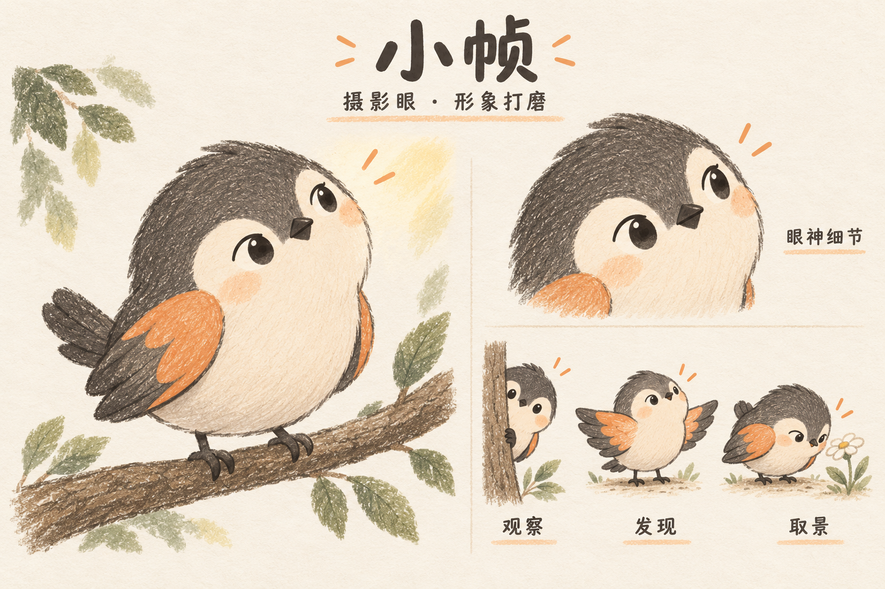
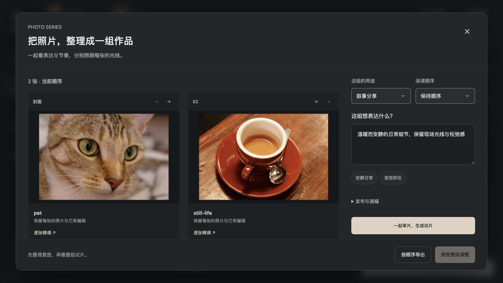
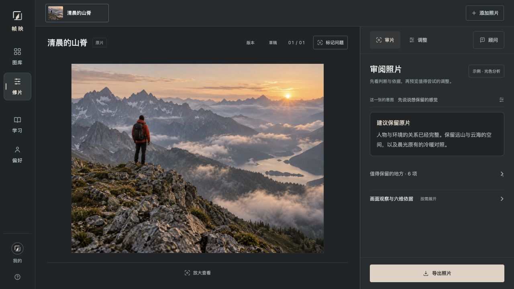
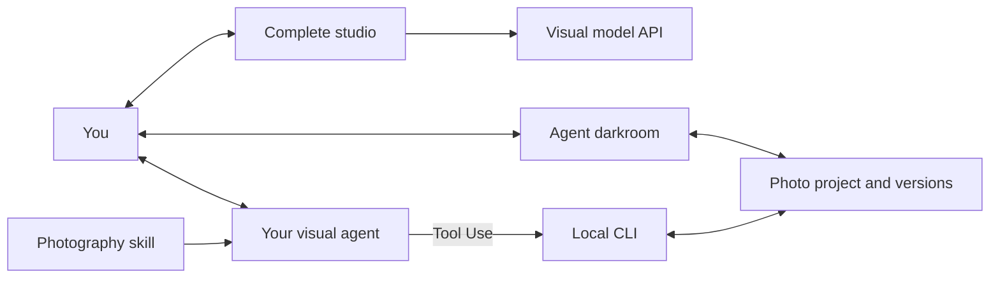

# Zhenhao · 帧好



[](https://ai-photography-preview-geminilights-projects.vercel.app/ "Online demo · Vercel access required")
[](#agent-skill)
[](#web-ui)
[](https://vercel.com/new/clone?repository-url=https%3A%2F%2Fgithub.com%2FGeminiLight%2FZhenhao)
[](#photography-knowledge)

**Photo retouching with a complete Web studio, an Online Demo, and an agent skill.**

Upload photos, adjust color, compare styles, curate a series, and export in your browser. Your own visual agent can also use the Skill to work with originals, annotations, and saved versions. The frontend, AI routes, and Skill source are all included in this repository.

[简体中文](README.md) · [Get started](#get-started) · [Capabilities](#capabilities) · [Interface](#interface) · [Photography knowledge](#photography-knowledge)

## Meet Xiaozhen · 小帧

**Xiaozhen is Zhenhao’s photography companion: a curious little bird with an eye for photographs.** It helps you notice light, consider composition, and refine the feeling you want to keep.

Its graphite feathers, cream chest, apricot wings, and upward gaze stay consistent. The pencil texture adds warmth to the welcome screen, advisor avatar, and agent darkroom while your photograph remains the focus. The product is **Zhenhao · 帧好**; the companion is **Xiaozhen · 小帧**.

[Transparent avatar](public/assets/xiaozhen-avatar.png) · [Character guidelines](docs/WEB_DESIGN.md#品牌与小帧)

## Find your next photograph

Attach a scene photo and use the project’s [photography-eye skill](skills/photography-eye/SKILL.md):

> Use $photography-eye to find different photographs here. Tell me where to stand, how high to hold the camera, how to frame the shot, which settings to use, and how to finish the image afterward.

The skill offers viewpoints, timing, settings, and finishing targets, normally with one recommended image and four alternatives. Codex discovers it through `.agents/skills/photography-eye`. This scene-scouting workflow is currently available as a project skill.

## Theme-led selection and optional AI finishing

For a series, define its theme, choose varied images that belong together, refine each photograph, then review the sequence. People, wider scenes, and details can work together; a nine-image grid need not repeat one subject. See the [series workflow](skills/photo-retouch/references/theme-led-series.md).

The retouching skill checks which image-generation or editing tools the host actually provides. If none are available, it continues with the originals. When useful, it can generate a multi-image finishing board in one call, then review each panel before using it as a reference or deliverable. Individual panels still need adequate pixels and detail; see [AI finishing](skills/photo-retouch/references/generated-reference.md).

## Choose how to work

| Mode | Use | Start |
| --- | --- | --- |
| **Online Demo** | Multiple uploads, diagnosis, and an integrated advisor. Vercel access required. | [Open the online studio](https://ai-photography-preview-geminilights-projects.vercel.app/) |
| **Web UI** | Run the complete studio locally: multiple uploads, manual retouching, series, and export. Connect a visual model for diagnosis and the advisor. | [Start the studio](#web-ui) |
| **Agent skill** | Your agent reviews photos and proposes candidates; compare and refine them in the agent darkroom. No separate model service required. | [Install the skill](#agent-skill) |

## Get started

Requires **Node.js 20.9+**. Commands use macOS / Linux shell syntax. Cloning a private repository requires GitHub access.

```sh
git clone https://github.com/GeminiLight/Zhenhao.git
cd Zhenhao
```

### Web UI

Start the complete studio with one command; no npm dependency installation is needed:

```sh
npm start
```

Open **http://localhost:3177**. Upload, edit manually, apply styles, and export without a model connection. Configure a visual model in the local application's connection settings to enable AI review and the advisor. Press `Ctrl+C` to stop. The interface is currently in Chinese.

Or run with Docker:

```sh
docker compose up -d --build
```

[Deployment and model settings](docs/DEPLOYMENT.md) · [Deploy to Vercel](https://vercel.com/new/clone?repository-url=https%3A%2F%2Fgithub.com%2FGeminiLight%2FZhenhao)

### Agent darkroom

For file-based projects with your own agent, prepare image dependencies and create a project:

```sh
npm run setup
mkdir -p projects

node skills/photo-retouch/scripts/cli.mjs init \
  --image "/your/photo.jpg" \
  --project "./projects/my-photo" \
  --intent "Preserve natural colors and the existing light"

node skills/photo-retouch/scripts/cli.mjs serve \
  --project "./projects/my-photo"
```

Open the printed URL in the agent darkroom. Adjust controls, then select **生成试片** (Create trial), compare, and **接受这版** (Accept) or **取消试片** (Discard). Export after accepting.

Use a new project directory. Press `Ctrl+C` to stop the server; run `serve` again to continue the saved project.

<details>
<summary>Online Demo · Studio preview</summary>

The [Online Demo](https://ai-photography-preview-geminilights-projects.vercel.app/) offers multiple uploads, diagnosis, and an integrated advisor. It currently requires Vercel access. Check the page for the visual-model connection status.

The online application and `npm start` use this repository's frontend, API routes, and server. Studio drafts live in each browser; the agent darkroom uses file-based projects. Browser drafts remain separate; opening a shared file project synchronizes annotations, candidates, versions, and export records with the Skill. Portable project files remain available for explicit snapshot exchange.

</details>

### Agent skill

Requires an agent that can read images, run local tools, and load skills, such as Codex.

```sh
npm run install:skill
```

The default destination is `~/.codex/skills/photo-retouch`, with the identifier `photo-retouch`. The first installation prepares image dependencies. Reload the skill list or open a new task if it has not appeared. To migrate an existing `guangjian-retouch` installation, run `npm run install:skill -- --update`; the old installation is backed up before moving to the new directory.

Compare the original and trial looks on a shared frame before choosing a direction; evaluate cropping separately. Agent-saved trials are not treated as your preferences, and explicitly rejected versions are excluded from preference evidence. [Look development and comparison](skills/photo-retouch/references/look-development.md)

Send this to your agent:

```text
Use $photo-retouch to review /photos/morning.jpg.
Keep the quiet morning atmosphere and natural colors.
Explain what to preserve, then propose adjustments I can preview.
```

Ask the agent to open the local darkroom. Compare candidates or save annotations, then continue:

```text
Read the current version and all latest annotations.
Lift the person's shadows slightly, preserving the background and warm light.
Show a trial and explain the main changes and tradeoffs.
```

A review can recommend keeping the original. AI review uses your host agent's visual model, usage limits, and data rules, with no additional model key. Continue the conversation in that agent; “在 Agent 中继续” in the Web UI copies a project prompt.

Automatic retouching follows diagnosis → trial → review → acceptance → export. Diagnosis records the goal, relationships to preserve, locations, and tradeoffs; it may recommend no changes. In reviewed mode, agent acceptance requires a ready audit of the current combination and a response to every blocking finding. Tools verify version identity; aesthetic judgment comes from the host viewing the image. [Review and delivery](skills/photo-retouch/references/reviewed-workflow.md)

<details>
<summary>Calibration, second review, and project exchange</summary>

- **Actual photographs:** three licensed original / trial / overprocessed comparisons. `examples` opens the images; `probe` compares one control on the current photo without changing history.
- **Adjustment sources:** inspect manual, style, and local contributions. `rebuild` clears selected old layers in a reversible candidate, preserving other edits and constraints.
- **Separate review:** `review-packet` prepares originals, base and trial images, and checks. The host arranges the reviewer; tools do not call a second model or authenticate identity.
- **Portable preferences:** explicitly requested local records of user choices, subjects, light and reasons. Editable and removable; current intent takes priority.
- **Project exchange:** in the studio, open 草稿 → 与 Agent 继续编辑 to download or open `.frameyn.json`; use `project-export/import` in the Skill. Import adds a new project. Originals, saved versions, intent, comments and compatible edits transfer; lettering, brushes, protection constraints and conversations do not.

[Workflow and commands](skills/photo-retouch/references/reviewed-workflow.md) · [Visual examples](skills/photo-retouch/references/visual-examples.md) · [Preference records](skills/photo-retouch/references/learning-memory.md) (Chinese)

</details>

<details>
<summary>Update or install into another host</summary>

Updates back up the previous skill:

```sh
npm run install:skill -- --update
```

Specify a compatible host's skill directory:

```sh
node scripts/install-photo-skill.mjs /your/skills/photo-retouch
```

</details>

## Capabilities

### From a folder of photos to a finished set

Ask your agent to review a folder, select a set for a stated purpose, keep specific moments, propose an order, and preview a shared direction before editing. The skill creates stable-ID contact sheets, records selected / reserve / excluded decisions with visual reasons, and exports saved versions in sequence with a manifest. Originals stay intact; nothing is published automatically.

Supported workflows include travel stories, portraits, events, product catalogs, portfolios, and archives. A story or a shared preset is optional. Current intent takes priority over previous preferences.

- **Skill:** up to 500 files per batch, 20 thumbnails per page. The host supplies visual judgment; detail decisions require individual image inspection. Failed exports can be retried separately.
- **Web UI:** a 2–12 photo workspace for already selected images, with purpose, intent, sequencing, previews and ordered export. Manual order is respected.
- Changes to the brief, saved images or annotations make earlier curation stale. Browser drafts remain separate; shared file projects synchronize with the Skill.

[Collection workflow](skills/photo-retouch/references/collection-craft.md) · [CLI and tool contracts](skills/photo-retouch/references/collection-tools.md) (Chinese)



| Feature | Support |
| --- | --- |
| Light, color, and styles | 31 global controls, 14 presets, a separate style layer, and adjustable strength. |
| Cropping and local work | Cropping, straightening, rectangular / radial / gradient geometric masks, and feathering. |
| Viewing and comparison | Originals and versions, matched position and magnification, 100% viewing, zoom, and pan. |
| Annotations and collaboration | Region comments; the agent reads the current version, intent, and all latest annotations before continuing. |
| Projects and versions | Candidate previews, accept / discard, named versions, restoration, and export records. |
| Review and continuation | Structured diagnosis, combination-specific audits, adjustment sources, and compatible project exchange. |

- **Input:** static JPEG, PNG, WebP, and AVIF; 8-bit sRGB. Up to 30 MB, 50 megapixels, and a 16384 px longest edge.
- **Output:** PNG / JPEG with sharing, printing, and original-size presets. At most 8192 px / 16 megapixels, without upscaling; the original-size preset has the same limits.
- **HEIC / HEIF:** The macOS local workspace can convert static images. Other environments, RAW, and TIFF require conversion first. RAW development, a 16-bit workflow, automatic subject segmentation, and generative object editing are not supported.

Local tools make no model API requests. The preview listens only on `127.0.0.1`. Explicit user choices live in photo projects and can be organized into a local preference file on request, without automatic training or uploads.

## Selective edits and preservation

Select individual proposal items, preview the combined result, and accept one atomic version. Lock manual and effective style-adjusted parameters, or preserve an accepted rectangular/radial pixel core with an outward feather. Unlocking is previewed; crop/rotation changes are blocked while pixel protection is active. CLI, host JSON tools, and Web UI share validation.

See [controlled editing](docs/CONTROLLED_EDITS.md) for guarantees, migration, and verification limits.

## Optional lettering

Lettering is a separate mode, enabled only when requested. Keep the retouched photograph and preview short captions, cream-colored stickers, or small editorial titles before accepting. The local Web UI supports text, placement, size, color, and small heart or sparkle accents. Export with or without lettering; ordinary photo edits never add text automatically.

```text
Use $photo-retouch to add “A little joy” to this retouched photo.
Try a small cream-colored sticker in the negative space, away from the subject.
Show me the trial and keep a clean edition.
```

Fonts are supplied by the host computer; Chinese text requires an installed CJK font. See the [lettering guide](skills/photo-retouch/references/lettering.md).

## Interface

**Complete studio**: started with `npm start`, using the same source as the online application. The screenshot shows the built-in example with no visual model configured.



**Agent darkroom**: compare candidates in a file-based project with your own agent.

**Manual retouching**


<details>
<summary>Annotations, comparison, and export</summary>

**Annotations:** each marker has its own region and comment.


**Comparison:** current version on the left, unaccepted trial on the right.


**Export:** choose the purpose, format, size, and quality.


</details>

Actual local-interface screenshots using the built-in demo image. [Capture notes](docs/SCREENSHOTS.md)

## Photography knowledge

114 sections cover 10 subject and scene playbooks, look development and result review, collection curation and delivery, with learning references from 10 photographers. These references guide observation; they are not official presets or exact reproductions.

<details>
<summary>Knowledge directory and search</summary>

References are currently written in Chinese.

| Topic | Documents |
| --- | --- |
| Judgment and composition | [Aesthetic judgment](skills/photo-retouch/references/aesthetic-judgment.md) · [Composition](skills/photo-retouch/references/composition-craft.md) |
| Subjects and scenes | [Subject playbooks](skills/photo-retouch/references/subject-playbooks.md) |
| Collections | [Purpose, curation and sequencing](skills/photo-retouch/references/collection-craft.md) · [Local collection tools](skills/photo-retouch/references/collection-tools.md) |
| Light, color, and detail | [Light and color](skills/photo-retouch/references/light-color.md) · [Local work and output](skills/photo-retouch/references/detail-local-crop.md) |
| Styles and sources | [Style atlas](skills/photo-retouch/references/style-atlas.md) · [Sources](skills/photo-retouch/references/sources.md) |
| Cases and feedback | [Casebook](skills/photo-retouch/references/casebook.md) · [Learning records](skills/photo-retouch/references/learning-memory.md) |
| Calibration and delivery | [Visual examples](skills/photo-retouch/references/visual-examples.md) · [Diagnosis, review and exchange](skills/photo-retouch/references/reviewed-workflow.md) |
| Video | [Color and editing knowledge](skills/photo-retouch/references/video-craft.md) |

```sh
node skills/photo-retouch/scripts/knowledge.mjs search --query 'Hideaki Hamada portrait skin'
node skills/photo-retouch/scripts/knowledge.mjs read --id style-daily-soft
```

Local keyword search makes no model requests; review still requires the agent to inspect the image. Video guidance supports planning. Execution needs other host media tools; this photo CLI does not import or export video.

</details>

<details>
<summary>Architecture</summary>



The agent darkroom and CLI share file-based project records. Originals are stored separately. A candidate becomes current only after acceptance; changes to the base version or annotations invalidate old candidates. The complete studio uses browser drafts and connects its advisor to the configured visual model through server-side routes.

</details>

## Development

```sh
npm run setup
npm run engine:check
npm run knowledge:check
npm test
```

`npm run test:web` checks the complete studio, AI routes, and photo processing. `npm run test:skill` checks projects, selective editing, protections, rendering, and knowledge retrieval. `npm test` runs both. Licensed Web photo fixtures and generated Skill charts are kept separately. See [validation scope](docs/VALIDATION.md).

[Contributing](CONTRIBUTING.md) · [Skill entry point](skills/photo-retouch/SKILL.md) · [CLI and JSON reference](skills/photo-retouch/references/tools.md)

## Contributors

Thanks to [Yijie Xu (@yeahjack)](https://github.com/yeahjack) for selective edit acceptance, parameter and local-layer locks, protected regions, and rendering and preview responsiveness improvements: [#1](https://github.com/GeminiLight/Zhenhao/pull/1), [#2](https://github.com/GeminiLight/Zhenhao/pull/2).

## Shared local projects

After `npm run setup`, use **文件项目** in the Web workspace to save the current photo or open an existing Skill project. Both surfaces share annotations, candidates, saved versions and export records, with revision checks for concurrent edits. `npm run photo -- studio --project /path/to/project` returns a link to the same project in the complete workspace. Protected or lettering projects continue in the standalone darkroom.

The macOS local workspace can convert static HEIC/HEIF images with the system decoder and preserve original bytes. Other platforms, RAW and TIFF still require conversion.

### Continuing with an agent in the local studio

Local file projects now open reviewed workflows, text overlays, and protected edits inside the full studio's collaboration editor. The native project runtime remains authoritative; advanced edits are not flattened into browser snapshots. The standalone `serve` command remains available.

“Continue with Agent” stores a handoff request and copies project context. Use `handoff` to claim work, report progress, and return real candidates; `watch --project <folder> --timeout 60` waits for requests or project changes. The host agent owns model execution and visual assessment. Human acceptance, cancellation, revision checks, and audit requirements remain separate.
