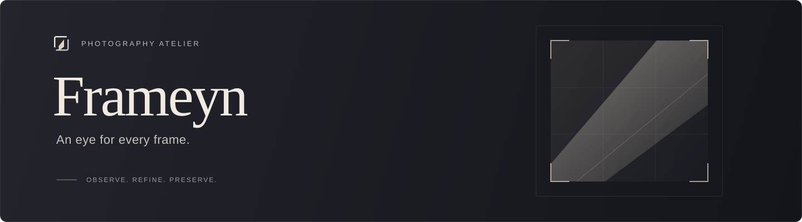
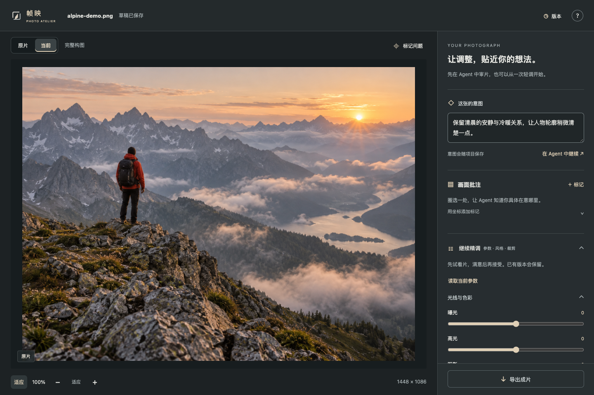
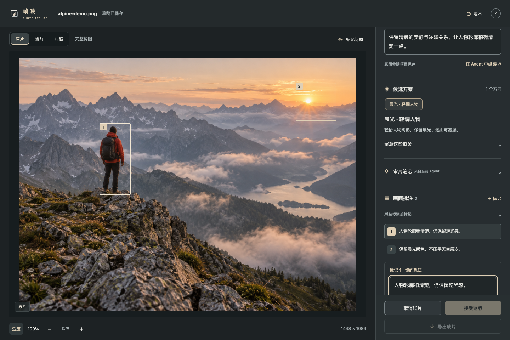
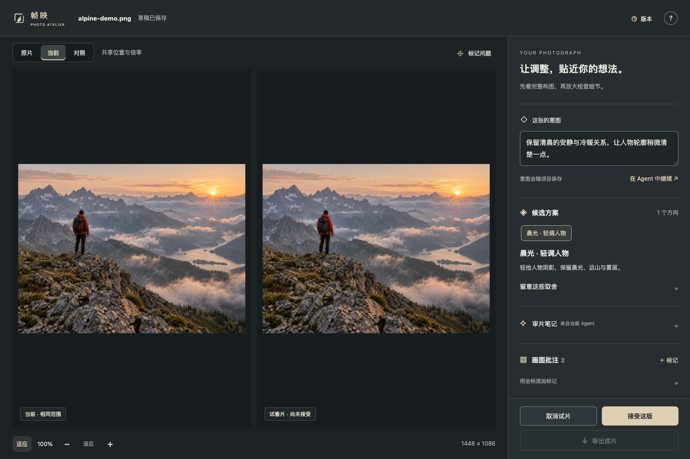
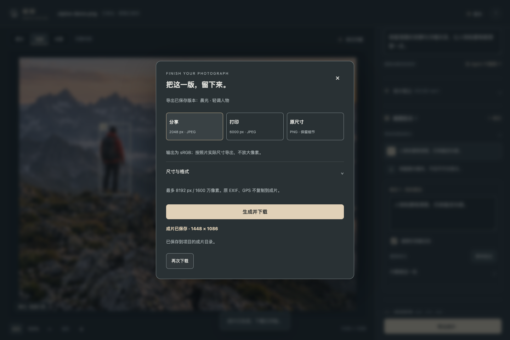
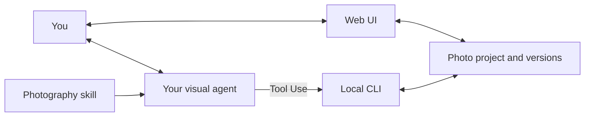

# Frameyn · 帧映



[](https://ai-photography-preview-geminilights-projects.vercel.app/ "Online demo · Vercel access required")
[](#agent-skill)
[](#web-ui)
[](#photography-knowledge)

**Photo retouching with an Online Demo, a Web UI, and an agent skill.**

Work locally in your browser or ask a visual agent to review the photograph and suggest edits you can preview. Both work with the same photo project, preserving originals, annotations, and versions.

[简体中文](README.md) · [Get started](#get-started) · [Capabilities](#capabilities) · [Interface](#interface) · [Photography knowledge](#photography-knowledge)

## Choose how to work

| Mode | Use | Start |
| --- | --- | --- |
| **Online Demo** | Multiple uploads, diagnosis, and an integrated advisor. Vercel access required. | [Open the online studio](https://ai-photography-preview-geminilights-projects.vercel.app/) |
| **Web UI** | Adjust light and color, try styles, crop, and export manually. No agent required. | [Start the darkroom](#web-ui) |
| **Agent skill** | Your agent reviews the image and proposes candidates; compare and refine them in the Web UI. | [Install the skill](#agent-skill) |

## Get started

Requires **Node.js 20.9+**. Commands use macOS / Linux shell syntax. Cloning a private repository requires GitHub access.

```sh
git clone https://github.com/GeminiLight/frameyn.git
cd frameyn
```

### Web UI

Prepare dependencies, choose a photograph, and create a project:

```sh
npm run setup
mkdir -p projects

node skills/guangjian-retouch/scripts/cli.mjs init \
  --image "/your/photo.jpg" \
  --project "./projects/my-photo" \
  --intent "Preserve natural colors and the existing light"

node skills/guangjian-retouch/scripts/cli.mjs serve \
  --project "./projects/my-photo"
```

Open the printed URL. Adjust controls, then select **生成试片** (Create trial), compare, and **接受这版** (Accept) or **取消试片** (Discard). Export after accepting. The interface is currently in Chinese.

Use a new project directory. Press `Ctrl+C` to stop the server; run `serve` again to continue the saved project.

<details>
<summary>Online Demo · Studio preview</summary>

The [Online Demo](https://ai-photography-preview-geminilights-projects.vercel.app/) offers multiple uploads, diagnosis, and an integrated advisor. It currently requires Vercel access. Check the page for the visual-model connection status.

It is a separate deployment whose source is not included in this repository. Browser drafts do not automatically synchronize with local projects.

</details>

### Agent skill

Requires an agent that can read images, run local tools, and load skills, such as Codex.

```sh
npm run install:skill
```

The default destination is `~/.codex/skills/guangjian-retouch`. The first installation prepares image dependencies. The skill keeps the identifier `guangjian-retouch` for compatibility. Reload the skill list or open a new task if it has not appeared.

Send this to your agent:

```text
Use $guangjian-retouch to review /photos/morning.jpg.
Keep the quiet morning atmosphere and natural colors.
Explain what to preserve, then propose adjustments I can preview.
```

Ask the agent to open the local darkroom. Compare candidates or save annotations, then continue:

```text
Read the current version and all latest annotations.
Lift the person's shadows slightly, preserving the background and warm light.
Show a trial and explain the main changes and tradeoffs.
```

A review can recommend keeping the original. AI review uses your host agent's visual model, usage limits, and data rules, with no additional model key. Continue the conversation in that agent; “在 Agent 中继续” in the Web UI copies a project prompt.

<details>
<summary>Update or install into another host</summary>

Updates back up the previous skill:

```sh
npm run install:skill -- --update
```

Specify a compatible host's skill directory:

```sh
node scripts/install-photo-skill.mjs /your/skills/guangjian-retouch
```

</details>

## Capabilities

| Feature | Support |
| --- | --- |
| Light, color, and styles | 31 global controls, 14 presets, a separate style layer, and adjustable strength. |
| Cropping and local work | Cropping, straightening, rectangular / radial / gradient geometric masks, and feathering. |
| Viewing and comparison | Originals and versions, matched position and magnification, 100% viewing, zoom, and pan. |
| Annotations and collaboration | Region comments; the agent reads the current version, intent, and all latest annotations before continuing. |
| Projects and versions | Candidate previews, accept / discard, named versions, restoration, and export records. |

- **Input:** static JPEG, PNG, WebP, and AVIF; 8-bit sRGB. Up to 30 MB, 50 megapixels, and a 16384 px longest edge.
- **Output:** PNG / JPEG with sharing, printing, and original-size presets. At most 8192 px / 16 megapixels, without upscaling; the original-size preset has the same limits.
- **Convert first:** HEIC, RAW, and TIFF. RAW development, a 16-bit workflow, automatic subject segmentation, and generative object editing are not supported.

Local tools make no model API requests. The preview listens only on `127.0.0.1`. Accepted choices are recorded as preferences within the current photo project only.

## Optional lettering

Lettering is a separate mode, enabled only when requested. Keep the retouched photograph and preview short captions, cream-colored stickers, or small editorial titles before accepting. The local Web UI supports text, placement, size, color, and small heart or sparkle accents. Export with or without lettering; ordinary photo edits never add text automatically.

```text
Use $guangjian-retouch to add “A little joy” to this retouched photo.
Try a small cream-colored sticker in the negative space, away from the subject.
Show me the trial and keep a clean edition.
```

Fonts are supplied by the host computer; Chinese text requires an installed CJK font. See the [lettering guide](skills/guangjian-retouch/references/lettering.md).

## Interface

**Manual retouching**



<details>
<summary>Annotations, comparison, and export</summary>

**Annotations:** each marker has its own region and comment.



**Comparison:** current version on the left, unaccepted trial on the right.



**Export:** choose the purpose, format, size, and quality.



</details>

Actual local-interface screenshots using the built-in demo image. [Capture notes](docs/SCREENSHOTS.md)

## Photography knowledge

79 sections cover 10 subject and scene playbooks, with learning references from 10 photographers. These references guide observation; they are not official presets or exact reproductions.

<details>
<summary>Knowledge directory and search</summary>

References are currently written in Chinese.

| Topic | Documents |
| --- | --- |
| Judgment and composition | [Aesthetic judgment](skills/guangjian-retouch/references/aesthetic-judgment.md) · [Composition](skills/guangjian-retouch/references/composition-craft.md) |
| Subjects and scenes | [Subject playbooks](skills/guangjian-retouch/references/subject-playbooks.md) |
| Light, color, and detail | [Light and color](skills/guangjian-retouch/references/light-color.md) · [Local work and output](skills/guangjian-retouch/references/detail-local-crop.md) |
| Styles and sources | [Style atlas](skills/guangjian-retouch/references/style-atlas.md) · [Sources](skills/guangjian-retouch/references/sources.md) |
| Cases and feedback | [Casebook](skills/guangjian-retouch/references/casebook.md) · [Learning records](skills/guangjian-retouch/references/learning-memory.md) |
| Video | [Color and editing knowledge](skills/guangjian-retouch/references/video-craft.md) |

```sh
node skills/guangjian-retouch/scripts/knowledge.mjs search --query 'Hideaki Hamada portrait skin'
node skills/guangjian-retouch/scripts/knowledge.mjs read --id style-daily-soft
```

Local keyword search makes no model requests; review still requires the agent to inspect the image. Video guidance supports planning. Execution needs other host media tools; this photo CLI does not import or export video.

</details>

<details>
<summary>Architecture</summary>



The Web UI and CLI share project records. Originals are stored separately. A candidate becomes current only after acceptance; changes to the base version or annotations invalidate old candidates. Discussion markers and accepted local adjustments are stored separately.

</details>

## Development

```sh
npm run setup
npm run knowledge:check
npm test
```

15 tests cover projects, pixel processing, local sessions, and knowledge retrieval. Technical tests use generated charts; actual photo observations are recorded separately. See [validation scope](docs/VALIDATION.md).

[Contributing](CONTRIBUTING.md) · [Skill entry point](skills/guangjian-retouch/SKILL.md) · [CLI and JSON reference](skills/guangjian-retouch/references/tools.md)
