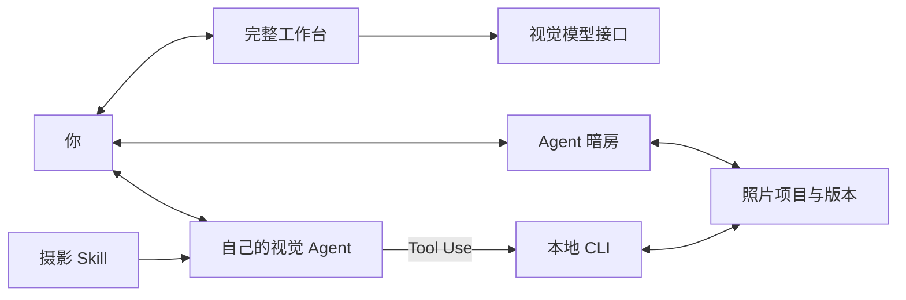

# 帧好 · FrameLark


[](#codex-plugin)
[](https://ai-photography-preview-geminilights-projects.vercel.app/ "在线体验 · 需要 Vercel 访问权限")
[](#agent-skill)
[](#web-ui)
[](https://vercel.com/new/clone?repository-url=https%3A%2F%2Fgithub.com%2FGeminiLight%2FFrameLark)
[](#摄影知识)

**摄影眼与照片精修，提供统一 Codex 插件、独立 Skill 和浏览器工作台。**

在浏览器中上传照片，审片、调色、比较风格、整理组图和导出。也可以让自己的视觉 Agent 使用 Skill，围绕原片、批注和版本继续精修。前端、AI 接口和 Skill 源码都在这个仓库中。

[English](README.en.md) · [开始使用](#开始使用) · [功能与范围](#功能与范围) · [界面](#界面) · [摄影知识](#摄影知识)

## 开始使用

**Codex 用户推荐安装统一插件，一次获得「摄影眼」和「照片精修」。** 想用其他支持 Skill 的 Agent，可单独安装 Skill；想直接在浏览器操作，可启动 Web UI。选择一种入口即可。

| 你想怎么用 | 安装入口 | 会得到什么 |
| --- | --- | --- |
| 在 Codex 对话中拍摄、选片和修图（推荐） | [安装统一插件](#codex-plugin) | 两套 Skill、知识与本地修图工具 |
| 只装 Skill，或使用其他兼容 Agent | [独立安装 Skill](#agent-skill) | 两套一起装，或只装摄影眼 / 修图 |
| 用网页手动精修和对比 | [启动 Web UI](#web-ui) | 浏览器工作台；接入模型后启用 AI 顾问 |

### 先准备什么

本地修图需要 **Node.js 20.9+（含 npm）**；下面的克隆步骤需要 Git。插件方式还需要支持 `codex plugin` 的 Codex CLI。已有桌面应用不代表终端一定能找到 `codex`；可先运行 `codex plugin --help` 确认，未识别时按[官方 Codex CLI 说明](https://learn.chatgpt.com/docs/codex/cli)安装或更新。

插件和 Skill 使用当前 Agent 的看图、对话能力，**无需另填一份模型 API Key**。可选 AI 生图 / 图片编辑取决于宿主是否提供；网页内置 AI 顾问的接入另见 [Web UI](#web-ui)。

以下命令使用 macOS / Linux shell。先下载仓库：

```sh
git clone https://github.com/GeminiLight/FrameLark.git
cd FrameLark
```

<a id="codex-plugin"></a>

### 安装 Codex 插件（推荐）

```sh
npm run plugin:install
```

它会安装 `framelark@framelark`，并准备本地修图依赖。安装成功后输出 `ok: true`、两套 Skill 名称和 `retouchDependencies: ready`。

**开启一个新对话**，在插件 / Skill 列表确认 FrameLark 已启用，然后附图开始：

> 用 FrameLark 看这里怎么拍，给我不同机位、参数和后期方向。

> 用 FrameLark 精修这张照片。保留我喜欢的感觉，先审片，再给能比较的试片。

不想在终端操作，也可在已有 Codex 对话中说：「从 GeminiLight/FrameLark 注册插件市场，安装 framelark@framelark，确认包含摄影眼和照片精修。」Agent 会按当前环境执行安装。直接市场命令、安装检查和 ZIP 分发见 [插件说明](docs/PLUGIN.md)。当前使用仓库插件市场，尚未上架 OpenAI 官方通用插件目录。

<a id="agent-skill"></a>

### 独立安装 Skill

插件已包含两套 Skill；仅在想独立使用或宿主不支持 Codex 插件时选择此方式。

两套一起安装到 `~/.codex/skills/`：

```sh
npm run install:skills
```

只装照片精修：

```sh
npm run install:skill
```

只装摄影眼：

```sh
npm run install:photography-eye
```

安装后重新加载 Skill 列表或开启新对话。默认分别安装到 `~/.codex/skills/photo-retouch` 和 `~/.codex/skills/photography-eye`；摄影眼无需额外图片依赖，照片精修会自动准备固定版本的依赖。在能看图、执行本地工具的 Agent 中使用：

> 用 $photography-eye 看这里有哪些值得拍的画面，告诉我站哪、怎么取景和设置参数。

> 用 $photo-retouch 修这张照片。先说明值得保留的关系，再给可预览的调整方案。

更新前会备份已有 Skill：

```sh
npm run install:skills -- --update
```

使用其他兼容宿主时，把其 **skills 根目录**替换到下面的命令中：

```sh
npm run install:skills -- /你的/agent/skills
```

只安装单个 Skill 时，保留既有的目标目录用法：

```sh
node scripts/install-photo-skill.mjs /你的/agent/skills/photo-retouch
node scripts/install-photo-skill.mjs --skill photography-eye /你的/agent/skills/photography-eye
```

旧版 `guangjian-retouch` 可用 `npm run install:skill -- --update` 备份并迁移。照片批注、试片、版本和文字点缀的详细用法见 [照片精修流程](skills/photo-retouch/SKILL.md)；拍摄辅导见 [摄影眼](skills/photography-eye/SKILL.md)。

<a id="web-ui"></a>

### 启动 Web UI

在仓库目录运行：

```sh
npm start
```

打开 **http://localhost:3177**。网页工作台使用 Node.js 内置模块，无需先安装图片依赖或模型 Key；可上传、手动调色、裁剪、试风格和导出。想启用看图审片与顾问时，在网页「AI 模型设置」中连接视觉模型。与 Skill 共用文件项目时，再运行 `npm run setup` 准备图片依赖。

更多运行方式、Docker 与模型配置见 [部署说明](docs/DEPLOYMENT.md)。[Online Demo](https://ai-photography-preview-geminilights-projects.vercel.app/) 当前需要 Vercel 访问权限；无法进入时可使用本地工作台。

### 安装后没出现或运行失败

| 遇到什么 | 怎么处理 |
| --- | --- |
| 终端找不到 `codex`，或没有 `plugin` 命令 | 安装 / 更新 Codex CLI，或选择独立 Skill 安装；仅运行 Web UI 不需要 Codex |
| 提示 Skill 已安装 | 更新时加 `--update`；安装器会保留旧版备份 |
| 插件 / Skill 列表没有新条目 | 开启新对话，或按宿主要求刷新 / 重启应用 |
| 图片依赖下载失败 | 检查 Node 版本及 npm 网络连接后重试；安装器在依赖准备完成前保留旧 Skill |
| 没有生图工具或视觉模型 | Skill 跳过不可用的 AI 生图环节；网页保留手动编辑，不能把光色统计当成看图审片 |

## 认识小帧

**小帧是帧好的摄影伙伴，一只有「摄影眼」的观察小鸟。** 它好奇、细心，陪你看光落在哪里、构图如何取舍，再把照片修成想留下的样子。

石墨灰的羽毛、奶油白的胸口、杏橙色的翅膀和向光看的眼神，是小帧的固定特征。彩铅质感保留手绘温度；它出现在欢迎区、顾问头像和 Agent 暗房，编辑时仍以照片为主角。产品名是 **帧好（FrameLark）**，摄影伙伴叫 **小帧**。

[透明头像](apps/studio/public/assets/xiaozhen-avatar.png) · [形象使用规范](docs/WEB_DESIGN.md#品牌与小帧)

## 摄影眼：从现场找到下一张照片

附上一张现场照，使用项目内的 [photography-eye · 摄影眼](skills/photography-eye/SKILL.md)：

> 用 $photography-eye 看这里能拍什么。给我不同拍法，告诉我站哪、相机多高、怎么取景、用什么参数，以及拍完怎么调色精修。

它提供机位、时机、参数和后期成片目标，默认一张主推加四个候选。它通过 `.agents/skills/photography-eye` 链接供项目内 Codex 发现；网站尚未接入这套现场拍摄辅导。

## 主题选片与 AI 精修

整理组图时，先确定主题，再挑有共同气氛、各自有内容的照片，逐张打磨后再比较整组节奏。人物、大场景和细节可以互相呼应，不要求九张都拍同一种东西。完整流程见 [主题驱动的组图](skills/photo-retouch/references/theme-led-series.md)。

> 用 $photo-retouch 从这个目录整理一组朋友圈九宫格。先确定主题，挑有变化又互相呼应的九张，再逐张精修。保留原片，入选副本与成片分别放好，给我整组预览。

Skill 会先检查当前宿主是否有可用的生图或图片编辑工具；没有时跳过 AI 环节，继续原片精修。可用时按要求数量一次制作多图试片或综合精修板，逐格检查裁剪、光影、局部、质感与像素质量，再决定用作参考或交付。生成板不保证每格都有独立高分辨率，也不替代原片验收；流程见 [AI 多图试片与完整精修](skills/photo-retouch/references/generated-reference.md)。

## 功能与范围

### 从一批照片到一组作品

把照片目录交给 Agent，例如：

> 用 $photo-retouch 看一下这次海边旅行的照片，选六张，保留松弛感和真实光线。先给我选片和顺序，再试统一风格；第二张合照一定留下。

Skill 按用途整理主题与必留条件，生成带编号的联系表，记录入选、备选和不入选的画面依据，再逐张试片。最后按顺序导出成片与清单；不删除原图、不自动发布。支持旅行分享、人物交付、活动记录、商品展示、作品集和归档，不要求每种用途都编一个故事。

- **Skill**：每批最多 500 个文件，每页 20 张联系表；使用宿主的视觉能力，细节取舍需要打开单图。导出失败可逐张重试。
- **Web UI**：2–12 张已选照片的组图空间，选择用途、表达与排序依据，再审片、试片和顺序导出；可明确保持自己的顺序。
- 主题、已保存照片或批注更新后，旧组选片会标为过期，先复看再交付。Web 浏览器草稿独立保存；文件项目可与 Skill 同步。

执行命令与 JSON：[组图工具](skills/photo-retouch/references/collection-tools.md) · 选片方法：[组图创作](skills/photo-retouch/references/collection-craft.md)


| 功能 | 支持内容 |
| --- | --- |
| 光色与风格 | 31 项全局控制、14 款预设、独立风格层与强度调整。 |
| 裁剪与局部 | 裁剪、拉直，矩形 / 径向 / 渐变几何蒙版与羽化。 |
| 查看与比较 | 原片和版本对照、相同位置与倍率、100% 查看、缩放和平移。 |
| 批注与协作 | 圈选范围、评论；Agent 继续前读取当前版本、意图和全部最新批注。 |
| 文字点缀（可选） | 留白短句、奶油贴纸、小标题；独立文字层、预览精调，有字 / 无字导出。默认修片不加字。 |
| 项目与版本 | 候选预览、接受 / 取消、命名版本、恢复与导出记录。 |
| 审核与继续 | 结构化诊断、对应组合的复评、调整来源、兼容项目交换。 |

- **输入**：静态 JPEG、PNG、WebP、AVIF；8 位 sRGB。最多 30 MB、5000 万像素、最长边 16384 px。
- **输出**：PNG / JPEG，支持分享、打印与原尺寸预设。最多 8192 px / 1600 万像素，不放大；原尺寸预设也受此限制。
- **HEIC / HEIF**：macOS 本地版可自动转换静态照片，并保留原文件。其他环境及 RAW、TIFF 仍需先转换。当前不支持 RAW 显影、16 位工作流、自动主体分割或生成式增删物体。

本地工具不请求模型 API，预览只监听 `127.0.0.1`。用户明确选择保存在照片项目中；可按要求整理为本地偏好档案，不会自动训练或上传。

## 逐项采纳与保留

候选支持按项勾选、组合预览与一次接受。可以锁定手动和风格后的有效参数，或在已保存画面圈选需要保留的硬核心，外侧过渡带连接后续调整。解除保护先试片，保护期间裁剪与拉直会锁定。CLI、宿主 JSON 工具和 Web UI 使用同一套校验。

详见 [受控编辑说明](docs/CONTROLLED_EDITS.md) 与 [验证范围](docs/VALIDATION.md)。

## 界面

**完整工作台**：`npm start` 启动，与在线应用使用同一份源码。下图使用内置示例照片，未配置视觉模型。


**Agent 暗房**：与自己的 Agent 协作，比较文件项目中的候选。

**手动精调**


<details>
<summary>批注、对照与导出</summary>

**画面批注**：每处标记有独立范围与评论。


**候选对照**：左侧为当前版本，右侧为未接受的试片。


**导出成片**：按用途选择格式、尺寸与画质。


</details>

真实本地界面截图，使用内置演示图。[截图说明](docs/SCREENSHOTS.md)

## 摄影知识

169 个章节，覆盖 10 类题材与场景、定调与成片审核、整组选片与交付，并收录 10 位摄影师的学习参考。摄影师参考用于学习，不代表官方预设或精确复刻。

<details>
<summary>知识目录与检索</summary>

| 内容 | 文档 |
| --- | --- |
| 判断与构图 | [审美判断](skills/photo-retouch/references/aesthetic-judgment.md) · [构图与拍摄](skills/photo-retouch/references/composition-craft.md) |
| 题材与场景 | [题材策略](skills/photo-retouch/references/subject-playbooks.md) |
| 选片与组图 | [用途、主题、取舍与排序](skills/photo-retouch/references/collection-craft.md) · [联系表与整组工具](skills/photo-retouch/references/collection-tools.md) |
| 光色与细节 | [光线与色彩](skills/photo-retouch/references/light-color.md) · [局部与输出](skills/photo-retouch/references/detail-local-crop.md) |
| 风格与来源 | [风格图谱](skills/photo-retouch/references/style-atlas.md) · [来源](skills/photo-retouch/references/sources.md) |
| 案例与反馈 | [案例手册](skills/photo-retouch/references/casebook.md) · [学习记录](skills/photo-retouch/references/learning-memory.md) |
| 校准与交付 | [真实视觉案例](skills/photo-retouch/references/visual-examples.md) · [诊断、复审与交换](skills/photo-retouch/references/reviewed-workflow.md) |
| 视频 | [调色与剪辑知识](skills/photo-retouch/references/video-craft.md) |

```sh
node skills/photo-retouch/scripts/knowledge.mjs search --query '滨田英明 柔光人像 肤色'
node skills/photo-retouch/scripts/knowledge.mjs read --id style-daily-soft
```

本地关键词检索不调用模型，审片仍需 Agent 实际看图。视频知识用于方案判断；执行需要宿主另有媒体工具，本照片 CLI 不支持视频导入或导出。

</details>

<details>
<summary>工作原理</summary>



Agent 暗房与 CLI 读写同一份文件项目。原片单独保存，候选接受后才成为当前版本；版本或批注变化时，旧候选会失效。完整工作台使用浏览器草稿，内置顾问通过服务端接入用户配置的视觉模型。

</details>

## 开发

| 目录 | 内容 |
| --- | --- |
| `apps/studio` | 完整 Web 工作台与服务端 |
| `api` | Vercel 函数入口 |
| `skills` | 可独立安装的修片、摄影眼 Skill |
| `scripts` / `test` | 开发工具、质量检查与测试 |
| `docs` | 架构、运行说明、设计规范与截图 |

[项目结构与依赖关系](docs/ARCHITECTURE.md)

```sh
npm run setup
npm run architecture:check
npm run engine:check
npm run knowledge:check
npm test
```

`npm run test:web` 检查完整工作台、AI 接口和照片效果；`npm run test:skill` 检查项目、逐项选择、保护、渲染与知识检索。`npm test` 执行两组检查。Web 的授权照片检查集与 Skill 的生成测试图分别保存，见 [验证范围](docs/VALIDATION.md)。

[维护指南](CONTRIBUTING.md) · [Skill 入口](skills/photo-retouch/SKILL.md) · [CLI 与 JSON 参考](skills/photo-retouch/references/tools.md)

## 贡献者

感谢 [Yijie Xu（@yeahjack）](https://github.com/yeahjack) 贡献逐项调整采纳、参数与局部层锁定、画面区域保护，以及渲染和预览响应优化：[#1](https://github.com/GeminiLight/FrameLark/pull/1)、[#2](https://github.com/GeminiLight/FrameLark/pull/2)。
