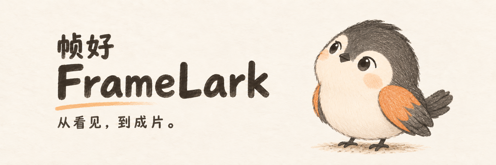
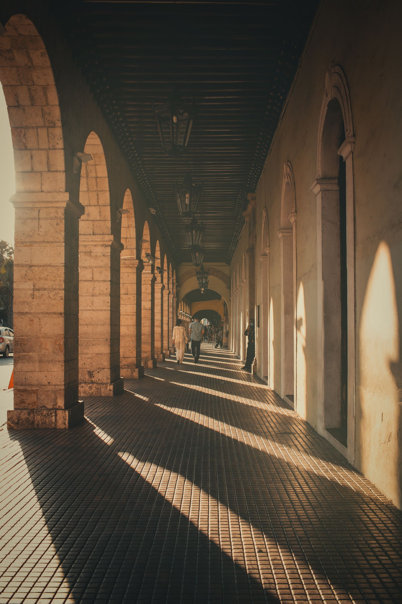
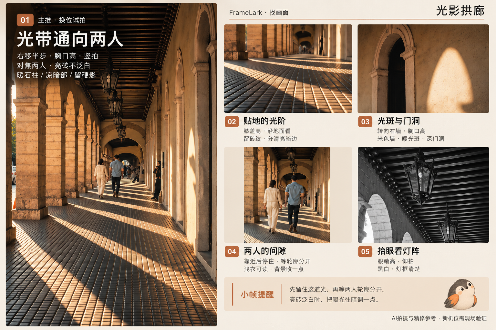
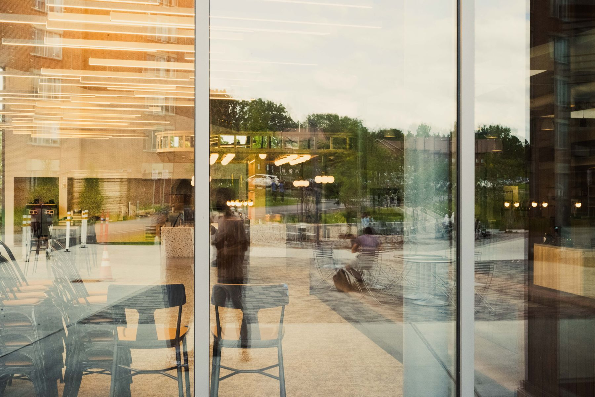
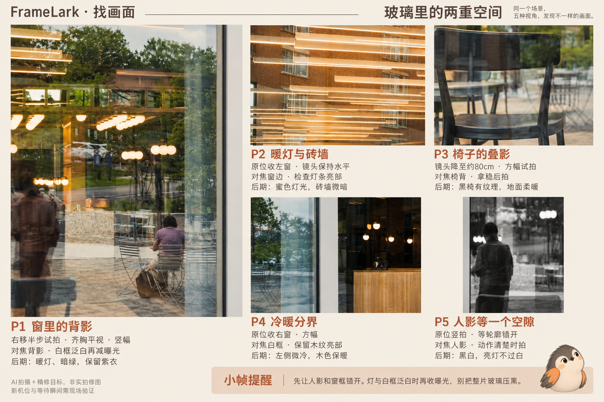
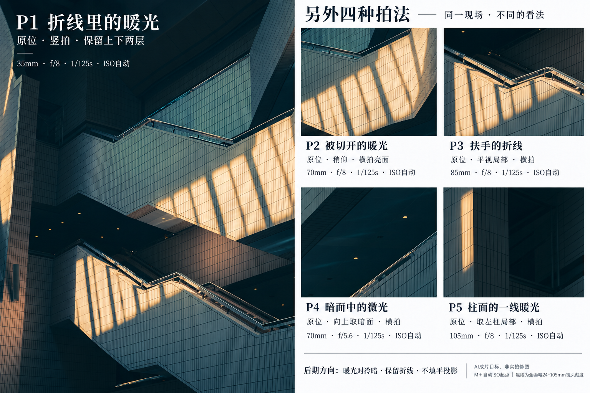
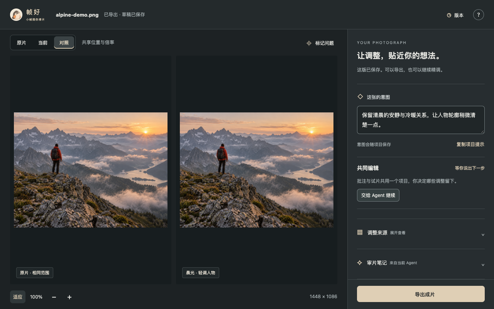
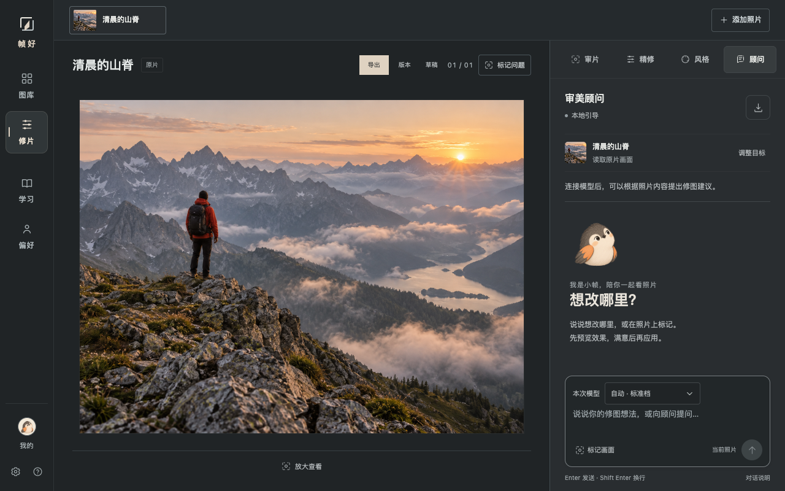

# 帧好 · FrameLark

**[访问官网](https://tianfuwang.tech/FrameLark/) · [在线基础修片](https://tianfuwang.tech/FrameLark/studio/)**



**你的 AI 摄影伙伴，让小帧陪你找画面、修照片、做组图。**

FrameLark 提供 Codex 插件、独立 Skill 和浏览器工作台，陪你从拍摄想法走到成片。

[English](README.en.md) · [开始使用](#开始使用) · [使用指南](docs/USAGE.md)

## 创作能力

| 想做什么 | 小帧怎么帮你 |
| --- | --- |
| **[找画面 · 摄影眼](#photography-eye-demo)** | 从现场照发现值得拍的画面，给你机位、构图、时机和参数建议。 |
| **[修照片 · 精修台](#photo-retouch-demo)** | 打磨光色、裁剪和局部细节，自定义风格，比较试片后再接受。 |
| **[做组图 · 组图册](#photo-series-demo)** | 先确定主题，再精选照片、逐张精修、安排顺序，让整组互相呼应。 |

人物、大场景和细节都可以放进同一组，靠主题与节奏联系起来。摄影眼由 `photography-eye` Skill 提供；精修台和组图册由 `photo-retouch` Skill 提供。

小帧是一只有「摄影眼」的观察小鸟，也是帧好的摄影伙伴。[认识小帧](docs/WEB_DESIGN.md#品牌与小帧)

<a id="codex-plugin"></a>

## 开始使用

**一次安装统一插件，获得找画面、修照片和做组图三种能力。**

### 安装

推荐让本地 Codex 代装，直接发送：

> 帮我从 https://github.com/GeminiLight/FrameLark 安装 FrameLark 统一插件，检查环境、准备本地修图工具，完成后告诉我怎么开始使用。

也可以手动安装。需要 **Node.js 20.9+（含 npm）、Git 和支持插件的 Codex CLI**，在终端运行：

```sh
git clone https://github.com/GeminiLight/FrameLark.git
cd FrameLark
npm run plugin:install
```

### 安装后怎么用

**开启新对话**，附上照片或给出可访问的照片目录：

| 输入 | 直接说 |
| --- | --- |
| 一张现场照 | 用 FrameLark 看这里咋拍？ |
| 一张已拍原片 | 用 FrameLark 精修这张，准备发朋友圈，先给我试片。 |
| 一批照片目录 | 用 FrameLark 做朋友圈九宫格，先定主题，保留原片。 |

下一轮直接说「喜欢 P3，站哪里？」「把背景调柔一点」或「就这版，导出」。看图与可选生图使用当前 Agent 的能力，无需另填模型 Key；没有生图工具时先给文字拍法。

当前通过仓库插件市场安装。[安装准备与更新](docs/INSTALLATION.md) · [完整用法](docs/USAGE.md) · [效果示例](#使用示例)

### 其他入口

以下命令在上面的仓库目录中运行，选择适合自己的入口即可。

| 入口 | 怎么开始 |
| --- | --- |
| <a id="agent-skill"></a>独立 Skill | 运行 `npm run install:skills`，默认安装到 `~/.codex/skills/`；[单独安装、其他宿主与更新](docs/INSTALLATION.md#独立安装-skill)。 |
| <a id="web-ui"></a>浏览器工作台 | [在线基础修片](https://tianfuwang.tech/FrameLark/studio/)可直接用；完整本地工作台运行 `npm start`，打开 [localhost:3177](http://localhost:3177)。 |

在线基础修片支持浏览器内调色、裁剪、风格、版本与导出；完整本地工作台的 AI 顾问需在设置中连接视觉模型。现场拍摄辅导目前通过摄影眼 Skill 使用。

## 使用示例

<a id="photography-eye-demo"></a>

### 找画面 · 摄影眼

**输入一张现场照，问一句怎么拍，小帧给出不同的拍法。**

| 用户输入 | 用户怎么问 |
| --- | --- |
|  | 用 FrameLark 看这里咋拍？ |

**交付：主推＋四种拍法，附机位、对焦、后期方向和小帧提醒。**



上图是根据现场照设计拍法后打磨的参考板。它是 AI 拍摄与精修目标，局部会被重绘，新机位需现场试拍；实际精修继续使用用户原片。

<details>
<summary>更多摄影眼案例：玻璃倒影实测与光影楼梯</summary>

**换一个输入：咖啡馆玻璃倒影。** 独立子代理仅获得现场照、摄影眼 Skill 和“这里咋拍？”，一次整板生图交付五个方向；没有提供旧图板或旧提示词。





这张首版仍有比例和局部重绘偏差，用于方向参考。准确原位边界见[原片取景框](apps/studio/public/assets/cases/cafe-framing.png)。

**光影楼梯：**用户此前认可的空间、暖光与扶手折线示例。



</details>

[案例过程与来源](docs/CASE_STUDIES.md) · [官网案例：看输入与交付](https://tianfuwang.tech/FrameLark/examples.html)。

<a id="photo-retouch-demo"></a>

### 修照片 · 精修台

**输入：**一张已拍原片，以及想保留与改善的地方：

> 用 FrameLark 精修这张照片，保留晨光和远山层次，让人物稍微清楚一点，先给我试片。



**交付：**可比较的试片、可继续精调的版本，满意后导出成片。上图是内置演示项目的原片与已保存版本对照，不是本轮重新执行的自动精修。

<a id="photo-series-demo"></a>

### 做组图 · 组图册

**输入：**多张照片或可访问的目录，说明用途、数量与必留照片：

> 用 FrameLark 从这个目录整理朋友圈九宫格，先确定主题，再选片、逐张精修和排序，保留原片。


**交付：**围绕主题的选片、顺序与逐张精修成片。上图用猫与咖啡两张样片展示「安静日常」操作，不是已完成的九宫格。

[示例来源与操作说明](docs/SCREENSHOTS.md#三个能力的使用示例)

## 工作台预览



当前本地工作台的真实截图，使用内置示例照片，未连接视觉模型。[更多界面与截图说明](docs/SCREENSHOTS.md)

## 更多文档

| 想了解什么 | 去哪里看 |
| --- | --- |
| 安装、更新与常见问题 | [安装指南](docs/INSTALLATION.md) · [插件分发](docs/PLUGIN.md) |
| 拍摄、精修、组图与交付 | [使用指南](docs/USAGE.md) |
| 构图、光色与摄影师学习参考 | [摄影知识](docs/USAGE.md#摄影知识) |
| 本地运行、模型配置与部署 | [运行与部署](docs/DEPLOYMENT.md) |
| 开发、测试与贡献 | [项目结构](docs/ARCHITECTURE.md) · [维护指南](CONTRIBUTING.md) · [验证范围](docs/VALIDATION.md) |

## 贡献者

感谢 [Yijie Xu（@yeahjack）](https://github.com/yeahjack) 贡献逐项调整采纳、参数与局部层锁定、画面区域保护，以及渲染和预览响应优化：[#1](https://github.com/GeminiLight/FrameLark/pull/1)、[#2](https://github.com/GeminiLight/FrameLark/pull/2)。

