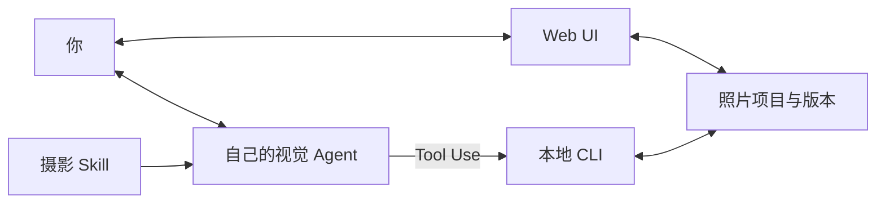

# Frameyn · 帧映


**人与 Agent 都能使用的摄影精修工作室。**

Frameyn · 帧映包含 **Web UI、摄影 Agent Skill 和本地像素工具**。你可以独立在浏览器中调光色、选风格、裁剪、查看细节并导出；也可以让已有的视觉 Agent 审片、解释取舍、生成候选，再回到同一间暗房继续精调。

照片、意图、批注和版本保存在本地项目中。人的手动选择和 Agent 的工具调用围绕同一份项目协作。

[English](README.en.md) · [Web UI 使用](#web-ui-使用) · [Agent Skill 使用](#agent-skill-使用) · [界面预览](#界面预览) · [工具参考](skills/guangjian-retouch/references/tools.md)

## 两种使用方式

| 入口 | 适合怎样使用 | 开始 |
| --- | --- | --- |
| **Web UI · 自己修片** | 在本地暗房查看照片、手动调参、试风格、裁剪和导出。可以独立使用，无需先安装 Agent。 | [启动本地暗房](#web-ui-使用) |
| **Agent Skill · 一起修片** | 让自己的视觉 Agent 看图、提出建议并调用工具；你在 Web UI 中比较候选、圈选评论、继续精调。 | [安装摄影 Skill](#agent-skill-使用) |

两种方式共用本地像素引擎与项目记录。已有 Agent 时可以交替使用：手动调整后，让它重新读取当前效果；保存批注后，让它围绕具体位置继续建议。

## 从看懂照片，到留下满意版本

| 环节 | 你能做什么 |
| --- | --- |
| **审片** | 看主体、背景、光线、构图、视觉秩序与情绪；先说明值得保留的关系。已经合适的照片可以得到“建议保留”。 |
| **试片** | 围绕“肤色真实”“保留清晨的安静”等意图创建候选，查看实际处理效果和主要取舍。 |
| **精调** | 在本地暗房对照原片、100% 查看、缩放和平移，手动调参或圈选评论；让 Agent 读取最新批注继续调整。 |
| **定稿** | 接受或取消候选，保存“自然版”“胶片版”等命名版本，随时恢复，再导出成片。 |

每个候选都从当前版本出发。光色、风格与局部调整有独立的处理层，原片字节保存在项目中；预览和取消不会覆盖已接受的版本。

## 界面预览

### 在 Web UI 中手动精调

照片是工作区中心，右侧提供创作意图、参数、风格和裁剪；底部保留查看与导出操作。


<details>
<summary>查看批注、候选对照与导出界面</summary>

**圈选并说明。** 每处标记保存自己的范围与评论；Agent 读取项目时获得全部最新批注。讨论标记与已接受的像素调整分别保存。


**先比较，再接受。** 当前版本与试片共享位置、构图和倍率，可以检查整体或放大细节。候选未接受前，已有版本会保留。


**按用途导出。** 分享、打印与原尺寸预设，配合格式、尺寸和画质设置；导出的是已保存版本。


</details>

截图来自实际运行的本地 Web UI，使用产品内置演示图展示交互；候选是一次轻调示例。[截图说明与复现方式](docs/SCREENSHOTS.md)

## Web UI 使用

需要 **Node.js 20.9+** 和现代浏览器。首次用命令选择照片并创建项目，之后在浏览器中操作，不要求 Agent 或模型 API Key。

```sh
git clone https://github.com/GeminiLight/frameyn.git
cd frameyn
npm run setup
mkdir -p projects

node skills/guangjian-retouch/scripts/cli.mjs init \
  --image "/你的/照片.jpg" \
  --project "./projects/my-photo" \
  --intent "保留自然色彩与原有光线"

node skills/guangjian-retouch/scripts/cli.mjs serve \
  --project "./projects/my-photo"
```

打开终端返回的本地地址，即可手动精调。调整参数、风格或裁剪后点击 **生成试片**，查看对照，再选择 **接受这版** 或 **取消试片**；接受后可以导出。

项目目录须是新目录，原片会单独保留。按 `Ctrl+C` 停止服务；再次运行 `serve` 打开同一项目即可恢复照片、批注和已保存版本，无需重新 `init`。命令示例使用 macOS / Linux shell。

### 在线工作室预览

另有独立部署的 [Web 工作室预览](https://ai-photography-preview-geminilights-projects.vercel.app/)，提供浏览器上传、多张照片、诊断与内置顾问等体验。该预览目前启用 Vercel 访问保护，需要有访问权限；视觉模型的启用状态以页面显示为准。

本仓库分发本地 Web UI、Skill 与 CLI，独立在线应用的部署源码暂未收录。在线工作室的浏览器草稿与本地照片项目不会自动同步。

## Agent Skill 使用

需要 **Node.js 20.9+**，以及能读取图片、运行本地工具并加载 Skill 的 Agent，例如 Codex。

### 1. 安装

```sh
git clone https://github.com/GeminiLight/frameyn.git
cd frameyn
npm run install:skill
```

首次安装会准备固定版本的 Sharp 与原生 Canvas 图片依赖。默认安装到 `~/.codex/skills/guangjian-retouch`。如果宿主尚未显示新 Skill，重新加载 Skill 列表或打开新任务。

> **安装标识**：品牌与仓库名已改为 Frameyn；Skill 暂时保留 `guangjian-retouch`，兼容已有安装和调用。下方示例使用这个实际可用的名称。

### 2. 给一张照片，说清想保留什么

在 Agent 中发送，把路径换成你的照片：

```text
用 $guangjian-retouch 帮我修这张照片：/照片/清晨.jpg。
保留清晨的安静和自然色彩。先审片，说明哪些地方值得保留；
只有在有明确收益时才调整，先给我看候选预览。
```

Agent 会读取原片与摄影知识，创建本地照片项目，再提供审片观察或候选。请它打开本地暗房，就可以查看、批注和继续精调。

### 3. 用批注继续对话

圈选画面后保存评论，再回到 Agent：

```text
读取我刚保存的全部批注。
人物稍微清楚一点，背景仍然保持安静；保留我标记的暖光。
基于当前版本试片，解释变化和代价，先让我对比。
```

对话在宿主 Agent 中进行，本地暗房负责查看、批注和精调。Agent 会在继续处理时重新读取批注；页面本身没有独立聊天模型。

<details>
<summary>更新已有 Skill，或安装到其他宿主</summary>

更新会先备份旧版本：

```sh
npm run install:skill -- --update
```

指定其他兼容宿主的 Skill 目录：

```sh
node scripts/install-photo-skill.mjs /你的/skills/guangjian-retouch
```

Skill 配有可独立运行的本地 Web UI 和工具，无需部署另一套模型服务。私有仓库的克隆需要有访问权限的 GitHub 账号。

</details>

## 摄影知识

Frameyn 按当前题材和问题读取相关知识：**79 个章节、10 类题材与场景、14 款风格预设，以及 10 位摄影师的学习线索**。

知识关注处理的条件与取舍。例如，逆光人像要检查人物可读性，也要保留逆光关系；风格选择要看原有光线、题材和意图。滨田英明、Saul Leiter、川内伦子等摄影师的作品用于学习观看方式，大师名称不代表官方滤镜、授权配方或精确复刻。

<details>
<summary>打开知识地图</summary>

| 想解决的问题 | 参考 |
| --- | --- |
| 什么值得修改，什么值得保留 | [审美判断](skills/guangjian-retouch/references/aesthetic-judgment.md) |
| 人像、风景、夜景、街头等场景 | [题材策略](skills/guangjian-retouch/references/subject-playbooks.md) |
| 主次、留白、空间与拍摄练习 | [构图与拍摄](skills/guangjian-retouch/references/composition-craft.md) |
| 曝光、肤色、白平衡、曲线与 HSL | [光线与色彩](skills/guangjian-retouch/references/light-color.md) |
| 锐化、降噪、局部、裁剪与输出 | [处理工艺](skills/guangjian-retouch/references/detail-local-crop.md) |
| 风格选择、适用条件与摄影师参考 | [风格图谱](skills/guangjian-retouch/references/style-atlas.md) |
| 视频色彩、镜头匹配、剪辑与声音 | [视频工艺](skills/guangjian-retouch/references/video-craft.md) |
| 已接受选择与反馈如何留下记录 | [学习与记忆](skills/guangjian-retouch/references/learning-memory.md) |
| 实际案例、推理练习与过度处理反例 | [案例手册](skills/guangjian-retouch/references/casebook.md) |
| 作者、厂商与真实引擎依据 | [来源](skills/guangjian-retouch/references/sources.md) |

本地关键词检索示例，在仓库目录运行：

```sh
node skills/guangjian-retouch/scripts/knowledge.mjs search --query '滨田英明 柔光人像 肤色'
node skills/guangjian-retouch/scripts/knowledge.mjs read --id style-daily-soft
```

检索不调用模型；实际审片仍需要 Agent 读取画面。

</details>

## Web UI、Skill 与 CLI 如何配合

| 部分 | 负责什么 |
| --- | --- |
| **你的视觉 Agent** | 看图、理解意图、说明依据、制定候选、读取最新批注并继续对话。 |
| **Frameyn Skill** | 提供摄影知识、审片流程、工具用法和处理检查点。 |
| **Web UI** | 人查看照片、手动精调、比较候选、保存批注、选择版本和导出。 |
| **CLI 与本地像素引擎** | Agent 或命令行创建项目、读写方案、处理原片像素，保存版本并导出。 |



本地工具不请求模型 API，无需额外模型 Key。图片提供给宿主视觉模型时，遵循宿主的数据处理规则与额度。预览服务只监听 `127.0.0.1`，项目保存照片、参数、裁剪、批注和版本，重新启动同一项目即可继续。

偏好记录来自实际接受的选择，当前仅限同一个照片项目。试片、浏览或取消不会被记录为认可；当前创作意图优先。

## 常见问题

**没有 Agent，能用吗？** 可以。本地 Web UI 支持独立手动修片；初次选择照片使用上面的 `init` 命令，之后在浏览器操作。视觉审片与 AI 对话需要一个具有看图能力的 Agent。

**Web UI 内能直接和 Agent 聊天吗？** 本地暗房中的「在 Agent 中继续」会复制当前项目提示，你在原 Agent 对话中继续。它没有独立聊天模型。在线工作室的内置顾问属于另一套部署入口。

**Agent 能看到我刚改的参数和评论吗？** 重新读取项目后可以。Skill 要求继续建议前核对当前版本、意图和全部最新批注；基础版本或批注变化时，旧候选会失效。

## 当前能力范围

| 项目 | 支持范围 |
| --- | --- |
| 光色与风格 | 31 项全局控制、独立风格层与强度调整。 |
| 构图与局部 | 裁剪、拉直，矩形 / 径向 / 渐变范围与羽化。局部范围是几何蒙版。 |
| 输入 | 静态 JPEG、PNG、WebP、AVIF；8 位 sRGB。最大 30 MB、5000 万像素、最长边 16384 px。 |
| 输出 | PNG / JPEG；分享、打印与原尺寸用途预设。最长边不超过 8192 px，总量不超过 1600 万像素，不放大。 |

HEIC、RAW、TIFF 需要先转换。当前没有 RAW 显影、16 位工作流、语义主体分割或生成式增删物体；“原尺寸”预设也受上述输出上限约束。

视频部分提供调色与剪辑判断知识；实际视频执行需要宿主另有媒体工具，本照片 CLI 没有视频时间线或视频导出。

## 开发与验证

```sh
npm run setup
npm run knowledge:check
npm test
```

现有 **15 项测试**覆盖原片保护、方向、候选冲突、参数与局部快照、命名版本、PNG 预览与导出的像素一致性、本地会话及知识检索。技术测试使用生成图；实际照片案例另有观察记录，摄影质量仍需按题材和输出尺寸逐一检查。

[验证范围](docs/VALIDATION.md) · [截图说明](docs/SCREENSHOTS.md) · [参与维护](CONTRIBUTING.md) · [Skill 入口](skills/guangjian-retouch/SKILL.md) · [工具命令与 JSON](skills/guangjian-retouch/references/tools.md)
