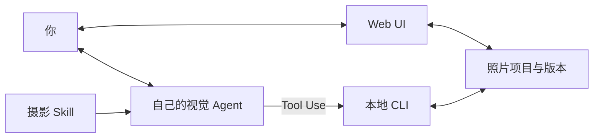

# Frameyn · 帧映


[](https://ai-photography-preview-geminilights-projects.vercel.app/ "在线体验 · 需要 Vercel 访问权限")
[](#agent-skill)
[](#web-ui)
[](#摄影知识)

**照片精修，提供 Online Demo、Web UI 和 Agent Skill。**

本地可在浏览器中手动调整，或让视觉 Agent 审片并提供可预览的修片方案。两种方式共用照片项目，保留原片、批注和版本。

[English](README.en.md) · [开始使用](#开始使用) · [功能与范围](#功能与范围) · [界面](#界面) · [摄影知识](#摄影知识)

## 使用方式

| 方式 | 用途 | 入口 |
| --- | --- | --- |
| **Online Demo** | 多图上传、诊断与内置顾问；需 Vercel 访问权限。 | [打开在线工作室](https://ai-photography-preview-geminilights-projects.vercel.app/) |
| **Web UI** | 手动调光色、试风格、裁剪和导出，无需 Agent。 | [启动本地暗房](#web-ui) |
| **Agent Skill** | 让自己的 Agent 审片、生成试片，再在 Web UI 中比较和精调。 | [安装 Skill](#agent-skill) |

## 开始使用

需要 **Node.js 20.9+**。以下命令使用 macOS / Linux shell；克隆私有仓库需要 GitHub 访问权限。

```sh
git clone https://github.com/GeminiLight/frameyn.git
cd frameyn
```

### Web UI

准备依赖，选择照片并创建项目：

```sh
npm run setup
mkdir -p projects

node skills/guangjian-retouch/scripts/cli.mjs init \
  --image "/你的/照片.jpg" \
  --project "./projects/my-photo" \
  --intent "保留自然色彩与原有光线"

node skills/guangjian-retouch/scripts/cli.mjs serve \
  --project "./projects/my-photo"
```

打开终端返回的地址，在浏览器中调整。点击 **生成试片** 查看对照，再 **接受这版** 或 **取消试片**；接受后导出。

项目目录须是新目录。按 `Ctrl+C` 停止服务，重新运行 `serve` 即可继续已保存的项目。

<details>
<summary>Online Demo · 在线工作室</summary>

[打开 Online Demo](https://ai-photography-preview-geminilights-projects.vercel.app/) 体验多图上传、诊断与内置顾问，目前需要 Vercel 访问权限。视觉模型状态以页面显示为准。

它是独立部署的应用，源码暂未包含在本仓库中；浏览器草稿与本地项目不会自动同步。

</details>

### Agent Skill

需要能看图、运行本地工具并加载 Skill 的 Agent，例如 Codex。

```sh
npm run install:skill
```

默认安装到 `~/.codex/skills/guangjian-retouch`，首次安装自动准备图片处理依赖。Skill 标识保留 `guangjian-retouch`，兼容已有调用；未显示时重新加载 Skill 列表或打开新任务。

在 Agent 中发送：

```text
用 $guangjian-retouch 审阅 /照片/清晨.jpg。
保留清晨的安静和自然色彩。先说明值得保留的部分，再给可预览的调整方案。
```

让 Agent 打开本地暗房，比较候选或保存批注。继续时可以说：

```text
读取当前版本和全部最新批注，轻抬人物阴影，保留背景与暖光。
先给我看试片，说明主要变化和代价。
```

审片可以得出保留原片的结论。AI 使用宿主 Agent 的视觉模型、额度和数据规则，无需另配模型 Key。对话在原 Agent 中继续；Web UI 的「在 Agent 中继续」会复制项目提示。

照片加字是单独的可选模式。例如：

```text
用 $guangjian-retouch 给当前修片版加一句“今天也有一点小确幸”。
做一个克制的奶油贴纸，放在留白处，避开主体。先给我看文字版，也保留无字版。
```

本地 Web UI 的 **文字点缀** 可修改文案、位置、字号、配色和轻装饰；接受前只生成候选。中文需本机有可用中文字体。详情见 [文字点缀](skills/guangjian-retouch/references/lettering.md)。

<details>
<summary>更新或安装到其他宿主</summary>

更新前会备份旧 Skill：

```sh
npm run install:skill -- --update
```

指定兼容宿主的 Skill 目录：

```sh
node scripts/install-photo-skill.mjs /你的/skills/guangjian-retouch
```

</details>

## 功能与范围

| 功能 | 支持内容 |
| --- | --- |
| 光色与风格 | 31 项全局控制、14 款预设、独立风格层与强度调整。 |
| 裁剪与局部 | 裁剪、拉直，矩形 / 径向 / 渐变几何蒙版与羽化。 |
| 查看与比较 | 原片和版本对照、相同位置与倍率、100% 查看、缩放和平移。 |
| 批注与协作 | 圈选范围、评论；Agent 继续前读取当前版本、意图和全部最新批注。 |
| 文字点缀（可选） | 留白短句、奶油贴纸、小标题；独立文字层、预览精调，有字 / 无字导出。默认修片不加字。 |
| 项目与版本 | 候选预览、接受 / 取消、命名版本、恢复与导出记录。 |

- **输入**：静态 JPEG、PNG、WebP、AVIF；8 位 sRGB。最多 30 MB、5000 万像素、最长边 16384 px。
- **输出**：PNG / JPEG，支持分享、打印与原尺寸预设。最多 8192 px / 1600 万像素，不放大；原尺寸预设也受此限制。
- **需先转换**：HEIC、RAW、TIFF。当前不支持 RAW 显影、16 位工作流、自动主体分割或生成式增删物体。

本地工具不请求模型 API，预览只监听 `127.0.0.1`。已接受的选择仅在当前照片项目中记录为偏好。

## 界面

**手动精调**


<details>
<summary>批注、对照与导出</summary>

**画面批注**：每处标记有独立范围与评论。


**候选对照**：左侧为当前版本，右侧为未接受的试片。


**导出成片**：按用途选择格式、尺寸与画质。


</details>

真实本地界面截图，使用内置演示图。[截图说明](docs/SCREENSHOTS.md)

## 摄影知识

79 个章节，覆盖 10 类题材与场景，并收录 10 位摄影师的学习参考。摄影师参考用于学习，不代表官方预设或精确复刻。

<details>
<summary>知识目录与检索</summary>

| 内容 | 文档 |
| --- | --- |
| 判断与构图 | [审美判断](skills/guangjian-retouch/references/aesthetic-judgment.md) · [构图与拍摄](skills/guangjian-retouch/references/composition-craft.md) |
| 题材与场景 | [题材策略](skills/guangjian-retouch/references/subject-playbooks.md) |
| 光色与细节 | [光线与色彩](skills/guangjian-retouch/references/light-color.md) · [局部与输出](skills/guangjian-retouch/references/detail-local-crop.md) |
| 风格与来源 | [风格图谱](skills/guangjian-retouch/references/style-atlas.md) · [来源](skills/guangjian-retouch/references/sources.md) |
| 案例与反馈 | [案例手册](skills/guangjian-retouch/references/casebook.md) · [学习记录](skills/guangjian-retouch/references/learning-memory.md) |
| 视频 | [调色与剪辑知识](skills/guangjian-retouch/references/video-craft.md) |

```sh
node skills/guangjian-retouch/scripts/knowledge.mjs search --query '滨田英明 柔光人像 肤色'
node skills/guangjian-retouch/scripts/knowledge.mjs read --id style-daily-soft
```

本地关键词检索不调用模型，审片仍需 Agent 实际看图。视频知识用于方案判断；执行需要宿主另有媒体工具，本照片 CLI 不支持视频导入或导出。

</details>

<details>
<summary>工作原理</summary>



Web UI 与 CLI 读写同一份项目。原片单独保存，候选接受后才成为当前版本；版本或批注变化时，旧候选会失效。讨论标记与已接受的局部调整分别保存。

</details>

## 开发

```sh
npm run setup
npm run knowledge:check
npm test
```

15 项测试覆盖项目、像素处理、本地会话与知识检索。技术测试使用生成图，实际照片观察另有记录，见 [验证范围](docs/VALIDATION.md)。

[维护指南](CONTRIBUTING.md) · [Skill 入口](skills/guangjian-retouch/SKILL.md) · [CLI 与 JSON 参考](skills/guangjian-retouch/references/tools.md)
