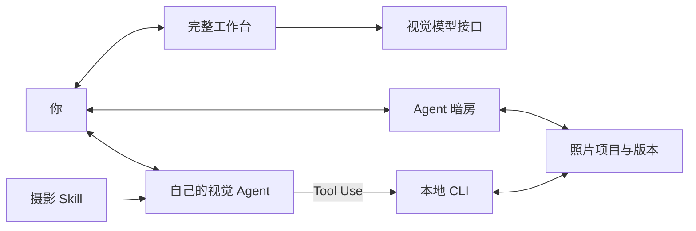

# Frameyn · 帧映


[](https://ai-photography-preview-geminilights-projects.vercel.app/ "在线体验 · 需要 Vercel 访问权限")
[](#agent-skill)
[](#web-ui)
[](https://vercel.com/new/clone?repository-url=https%3A%2F%2Fgithub.com%2FGeminiLight%2Fframeyn)
[](#摄影知识)

**照片精修，提供完整 Web 工作台、Online Demo 和 Agent Skill。**

在浏览器中上传照片，审片、调色、比较风格、整理组图和导出。也可以让自己的视觉 Agent 使用 Skill，围绕原片、批注和版本继续精修。前端、AI 接口和 Skill 源码都在这个仓库中。

[English](README.en.md) · [开始使用](#开始使用) · [功能与范围](#功能与范围) · [界面](#界面) · [摄影知识](#摄影知识)

## 使用方式

| 方式 | 用途 | 入口 |
| --- | --- | --- |
| **Online Demo** | 多图上传、诊断与内置顾问；需 Vercel 访问权限。 | [打开在线工作室](https://ai-photography-preview-geminilights-projects.vercel.app/) |
| **Web UI** | 本地运行完整工作台，上传多图、手动精修、组图和导出；接入视觉模型后启用诊断与顾问。 | [一键启动](#web-ui) |
| **Agent Skill** | 让自己的 Agent 审片、生成候选，在 Agent 暗房中比较和精调。无需另配模型服务。 | [安装 Skill](#agent-skill) |

## 开始使用

需要 **Node.js 20.9+**。以下命令使用 macOS / Linux shell；克隆私有仓库需要 GitHub 访问权限。

```sh
git clone https://github.com/GeminiLight/frameyn.git
cd frameyn
```

### Web UI

一条命令启动完整工作台，无需先安装 npm 依赖：

```sh
npm start
```

打开 **http://localhost:3177**。未接入模型时，可以上传、手动精修、使用风格和导出；在本地界面的模型接入设置中配置有视觉能力的模型，即可启用 AI 审片与顾问。按 `Ctrl+C` 停止。

也可以用 Docker 启动：

```sh
docker compose up -d --build
```

[部署与模型配置](docs/DEPLOYMENT.md) · [部署到 Vercel](https://vercel.com/new/clone?repository-url=https%3A%2F%2Fgithub.com%2FGeminiLight%2Fframeyn)

### Agent 暗房

围绕文件项目与自己的 Agent 协作时，准备图片处理依赖并创建项目：

```sh
npm run setup
mkdir -p projects

node skills/guangjian-retouch/scripts/cli.mjs init \
  --image "/你的/照片.jpg" \
  --project "./projects/my-photo" \
  --intent "保留自然色彩与原有光线"

node skills/guangjian-retouch/scripts/cli.mjs serve \
  --project "./projects/my-photo"
```

打开终端返回的地址，在 Agent 暗房中调整。点击 **生成试片** 查看对照，再 **接受这版** 或 **取消试片**；接受后导出。

项目目录须是新目录。按 `Ctrl+C` 停止服务，重新运行 `serve` 即可继续已保存的项目。

<details>
<summary>Online Demo · 在线工作室</summary>

[打开 Online Demo](https://ai-photography-preview-geminilights-projects.vercel.app/) 体验多图上传、诊断与内置顾问，目前需要 Vercel 访问权限。视觉模型状态以页面显示为准。

在线应用与 `npm start` 使用本仓库的 `public/`、`api/` 和服务端源码。工作台草稿保存在各自浏览器中；Agent 暗房使用文件项目。可主动交换照片项目快照，两类工作空间不会自动同步。

</details>

### Agent Skill

需要能看图、运行本地工具并加载 Skill 的 Agent，例如 Codex。

```sh
npm run install:skill
```

默认安装到 `~/.codex/skills/guangjian-retouch`，首次安装自动准备图片处理依赖。Skill 标识保留 `guangjian-retouch`，兼容已有调用；未显示时重新加载 Skill 列表或打开新任务。

在 Agent 中发送：

```text
用 $guangjian-retouch 审阅 /照片/清晨.jpg。
保留清晨的安静和自然色彩。先说明值得保留的部分，再给可预览的调整方案。
```

让 Agent 打开本地暗房，比较候选或保存批注。继续时可以说：

```text
读取当前版本和全部最新批注，轻抬人物阴影，保留背景与暖光。
先给我看试片，说明主要变化和代价。
```

风格调整可以先生成原片与候选的并排试片，再分别比较光色和构图。Agent 保存的试修不会自动成为你的风格偏好；明确拒绝的版本会从偏好参考中排除。[定调与试片流程](skills/guangjian-retouch/references/look-development.md)

自动精修采用「诊断 → 试片 → 复评 → 接受 → 导出」流程。诊断记录目标、保留关系、具体位置与代价，允许零项调整。reviewed 模式下，Agent 接受前必须有当前组合的通过审核，并逐项回答诊断中的阻碍问题。工具核对版本身份，审美判断来自宿主实际看图。[审片与交付](skills/guangjian-retouch/references/reviewed-workflow.md)

<details>
<summary>校准、复审与跨工作空间继续</summary>

- **真实对照**：三组有许可的原片、温和试片与过度处理反例；`examples` 打开实际图片，`probe` 在当前照片上比较单个参数。案例用于校准，不直接套配方。
- **调整来源**：展开查看手动、风格与局部贡献；`rebuild` 清理指定旧层，生成可撤回试片，保留其他调整与约束。
- **独立复审**：`review-packet` 准备原片、基础版、候选和检查点。宿主另行安排审片者；工具不自动调用第二模型，也不认证身份。
- **可携带偏好**：按用户要求建立本地档案，记录明确选择及题材、光线、理由；支持修改、删除，当前意图优先。
- **项目交换**：完整工作台「草稿 → 与 Agent 继续编辑」下载或打开 `.frameyn.json`；Skill 使用 `project-export/import`。交换原片、已保存版本、意图、批注和兼容调整，导入新增项目。文字、画笔、保护约束及对话不在交换范围内。

[流程与命令](skills/guangjian-retouch/references/reviewed-workflow.md) · [视觉案例](skills/guangjian-retouch/references/visual-examples.md) · [偏好档案](skills/guangjian-retouch/references/learning-memory.md)

</details>

审片可以得出保留原片的结论。AI 使用宿主 Agent 的视觉模型、额度和数据规则，无需另配模型 Key。对话在原 Agent 中继续；Web UI 的「在 Agent 中继续」会复制项目提示。

照片加字是单独的可选模式。例如：

```text
用 $guangjian-retouch 给当前修片版加一句“今天也有一点小确幸”。
做一个克制的奶油贴纸，放在留白处，避开主体。先给我看文字版，也保留无字版。
```

Agent 暗房的 **文字点缀** 可修改文案、位置、字号、配色和轻装饰；接受前只生成候选。中文需本机有可用中文字体。详情见 [文字点缀](skills/guangjian-retouch/references/lettering.md)。

<details>
<summary>更新或安装到其他宿主</summary>

更新前会备份旧 Skill：

```sh
npm run install:skill -- --update
```

指定兼容宿主的 Skill 目录：

```sh
node scripts/install-photo-skill.mjs /你的/skills/guangjian-retouch
```

</details>

## 功能与范围

### 从一批照片到一组作品

把照片目录交给 Agent，例如：

> 用 $guangjian-retouch 看一下这次海边旅行的照片，选六张，保留松弛感和真实光线。先给我选片和顺序，再试统一风格；第二张合照一定留下。

Skill 按用途整理主题与必留条件，生成带编号的联系表，记录入选、备选和不入选的画面依据，再逐张试片。最后按顺序导出成片与清单；不删除原图、不自动发布。支持旅行分享、人物交付、活动记录、商品展示、作品集和归档，不要求每种用途都编一个故事。

- **Skill**：每批最多 500 个文件，每页 20 张联系表；使用宿主的视觉能力，细节取舍需要打开单图。导出失败可逐张重试。
- **Web UI**：2–12 张已选照片的组图空间，选择用途、表达与排序依据，再审片、试片和顺序导出；可明确保持自己的顺序。
- 主题、已保存照片或批注更新后，旧组选片会标为过期，先复看再交付。Web 与 Skill 项目目前不自动同步。

执行命令与 JSON：[组图工具](skills/guangjian-retouch/references/collection-tools.md) · 选片方法：[组图创作](skills/guangjian-retouch/references/collection-craft.md)


| 功能 | 支持内容 |
| --- | --- |
| 光色与风格 | 31 项全局控制、14 款预设、独立风格层与强度调整。 |
| 裁剪与局部 | 裁剪、拉直，矩形 / 径向 / 渐变几何蒙版与羽化。 |
| 查看与比较 | 原片和版本对照、相同位置与倍率、100% 查看、缩放和平移。 |
| 批注与协作 | 圈选范围、评论；Agent 继续前读取当前版本、意图和全部最新批注。 |
| 文字点缀（可选） | 留白短句、奶油贴纸、小标题；独立文字层、预览精调，有字 / 无字导出。默认修片不加字。 |
| 项目与版本 | 候选预览、接受 / 取消、命名版本、恢复与导出记录。 |
| 审核与继续 | 结构化诊断、对应组合的复评、调整来源、兼容项目交换。 |

- **输入**：静态 JPEG、PNG、WebP、AVIF；8 位 sRGB。最多 30 MB、5000 万像素、最长边 16384 px。
- **输出**：PNG / JPEG，支持分享、打印与原尺寸预设。最多 8192 px / 1600 万像素，不放大；原尺寸预设也受此限制。
- **需先转换**：HEIC、RAW、TIFF。当前不支持 RAW 显影、16 位工作流、自动主体分割或生成式增删物体。

本地工具不请求模型 API，预览只监听 `127.0.0.1`。用户明确选择保存在照片项目中；可按要求整理为本地偏好档案，不会自动训练或上传。

## 逐项采纳与保留

候选支持按项勾选、组合预览与一次接受。可以锁定手动和风格后的有效参数，或在已保存画面圈选需要保留的硬核心，外侧过渡带连接后续调整。解除保护先试片，保护期间裁剪与拉直会锁定。CLI、宿主 JSON 工具和 Web UI 使用同一套校验。

详见 [受控编辑说明](docs/CONTROLLED_EDITS.md) 与 [验证范围](docs/VALIDATION.md)。

## 界面

**完整工作台**：`npm start` 启动，与在线应用使用同一份源码。下图使用内置示例照片，未配置视觉模型。


**Agent 暗房**：与自己的 Agent 协作，比较文件项目中的候选。

**手动精调**


<details>
<summary>批注、对照与导出</summary>

**画面批注**：每处标记有独立范围与评论。


**候选对照**：左侧为当前版本，右侧为未接受的试片。


**导出成片**：按用途选择格式、尺寸与画质。


</details>

真实本地界面截图，使用内置演示图。[截图说明](docs/SCREENSHOTS.md)

## 摄影知识

114 个章节，覆盖 10 类题材与场景、定调与成片审核、整组选片与交付，并收录 10 位摄影师的学习参考。摄影师参考用于学习，不代表官方预设或精确复刻。

<details>
<summary>知识目录与检索</summary>

| 内容 | 文档 |
| --- | --- |
| 判断与构图 | [审美判断](skills/guangjian-retouch/references/aesthetic-judgment.md) · [构图与拍摄](skills/guangjian-retouch/references/composition-craft.md) |
| 题材与场景 | [题材策略](skills/guangjian-retouch/references/subject-playbooks.md) |
| 选片与组图 | [用途、主题、取舍与排序](skills/guangjian-retouch/references/collection-craft.md) · [联系表与整组工具](skills/guangjian-retouch/references/collection-tools.md) |
| 光色与细节 | [光线与色彩](skills/guangjian-retouch/references/light-color.md) · [局部与输出](skills/guangjian-retouch/references/detail-local-crop.md) |
| 风格与来源 | [风格图谱](skills/guangjian-retouch/references/style-atlas.md) · [来源](skills/guangjian-retouch/references/sources.md) |
| 案例与反馈 | [案例手册](skills/guangjian-retouch/references/casebook.md) · [学习记录](skills/guangjian-retouch/references/learning-memory.md) |
| 校准与交付 | [真实视觉案例](skills/guangjian-retouch/references/visual-examples.md) · [诊断、复审与交换](skills/guangjian-retouch/references/reviewed-workflow.md) |
| 视频 | [调色与剪辑知识](skills/guangjian-retouch/references/video-craft.md) |

```sh
node skills/guangjian-retouch/scripts/knowledge.mjs search --query '滨田英明 柔光人像 肤色'
node skills/guangjian-retouch/scripts/knowledge.mjs read --id style-daily-soft
```

本地关键词检索不调用模型，审片仍需 Agent 实际看图。视频知识用于方案判断；执行需要宿主另有媒体工具，本照片 CLI 不支持视频导入或导出。

</details>

<details>
<summary>工作原理</summary>



Agent 暗房与 CLI 读写同一份文件项目。原片单独保存，候选接受后才成为当前版本；版本或批注变化时，旧候选会失效。完整工作台使用浏览器草稿，内置顾问通过服务端接入用户配置的视觉模型。

</details>

## 开发

```sh
npm run setup
npm run engine:check
npm run knowledge:check
npm test
```

`npm run test:web` 检查完整工作台、AI 接口和照片效果；`npm run test:skill` 检查项目、逐项选择、保护、渲染与知识检索。`npm test` 执行两组检查。Web 的授权照片检查集与 Skill 的生成测试图分别保存，见 [验证范围](docs/VALIDATION.md)。

[维护指南](CONTRIBUTING.md) · [Skill 入口](skills/guangjian-retouch/SKILL.md) · [CLI 与 JSON 参考](skills/guangjian-retouch/references/tools.md)

## 贡献者

感谢 [Yijie Xu（@yeahjack）](https://github.com/yeahjack) 贡献逐项调整采纳、参数与局部层锁定、画面区域保护，以及渲染和预览响应优化：[#1](https://github.com/GeminiLight/frameyn/pull/1)、[#2](https://github.com/GeminiLight/frameyn/pull/2)。
