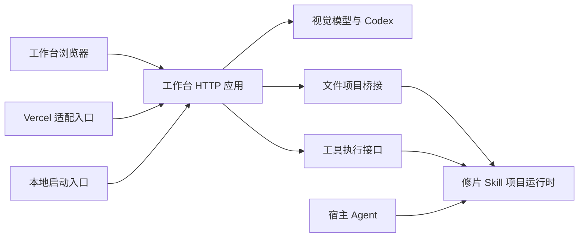

# 项目结构

帧好包含完整摄影工作台和三个 Agent Skill：`photography-eye` 提供现场拍法，`photo-retouch` 精修原片，`photo-series` 负责主题、选片与排列并协调逐张精修。工作台负责浏览器编辑、视觉顾问和本机项目协作。组图册与精修台共享同一份本地像素引擎和项目数据；独立摄影眼插件只提供现场拍法，统一 FrameLark 插件将三个 Skill 组合为一次安装。

```text
FrameLark/
├── plugin.json                portable 插件清单
├── .codex-plugin/             Codex 兼容清单
├── .agents/plugins/           仓库插件市场
├── assets/                    插件小帧图标
├── CLOUD.md                   从摄影眼维护来源生成的云端启动手册
├── plugins/framelark-eye/      独立摄影眼清单与生成的 GitHub 安装副本
├── apps/studio/
│   ├── public/                 浏览器界面、资源与图片处理模块
│   └── server/
│       ├── index.mjs           本地服务启动与关闭
│       ├── app.mjs             HTTP 请求处理；供本地与 Vercel 复用
│       ├── ai/                 模型协议、Codex 接入与组图审片
│       ├── projects/           文件项目路由与 Skill 项目桥接
│       └── tools/              修图工具执行接口
├── api/                        Vercel 函数适配入口
├── skills/
│   ├── photo-retouch/          修片 Skill、CLI、知识、独立暗房与引擎
│   ├── photo-series/          主题、选片、顺序与整组交付
│   └── photography-eye/        摄影眼 Skill 与知识检索
├── scripts/                    安装、质量评测和开发检查
├── test/                       Skill 与 Web 验证、授权样张
├── docs/                       架构、运行、设计和维护说明
│   └── images/                 品牌图板与 README 界面截图
└── .github/                    持续集成
```

## 入口与运行边界

| 入口 | 职责 |
| --- | --- |
| `npm start` / `npm run dev` | 运行 `apps/studio/server/index.mjs`，本机启动完整工作台 |
| `apps/studio/server/app.mjs` | 提供请求处理函数，导入时不监听端口 |
| `api/*.mjs` | Vercel 需要的薄适配层，复用工作台请求处理，不复制业务逻辑 |
| `npm run photo -- …` | 调用修片 Skill 的 CLI |
| `npm run cloud:build` | 从摄影眼维护来源生成云端手册与公开 TXT 下载，不打包修图依赖 |
| `npm run install:skill` | 安装完整 `skills/photo-retouch` 目录 |
| `npm run plugin:install:photography-eye` | 安装只有摄影眼的独立插件，不准备修图依赖 |
| `npm run plugin:sync:photography-eye` | 从维护来源生成完整 GitHub 插件目录；CI 比较逐文件内容 |
| `.agents/skills/photography-eye` | 指向摄影眼 Skill，供项目内 Agent 发现 |

运行配置、用户照片与项目目录按工作目录解析。浏览器静态资源、校验图和 Skill 运行时代码按源码位置解析；从其他目录启动也应正确找到资源。

Docker 和 Vercel 的根目录配置是平台入口。它们保留在根目录，业务源码集中在 `apps/studio`。根目录的 `package.json` 只负责稳定命令，完整 Web UI 仍可直接启动，无需安装前端构建依赖。

## 依赖关系



- 浏览器代码不依赖 Node 服务端；照片像素处理与临时预览在浏览器执行。
- 文件项目、候选事务、保护约束和审美审核记录由修片 Skill 的项目运行时管理，Web 通过桥接访问。
- Web 与 Skill 分发相同的像素和工具模块。`engine:check` 逐文件检查一致性，防止分发副本漂移；移动目录不能顺带改变处理结果。
- Skill 不依赖工作台目录，因此安装后的 CLI 和独立暗房仍能单独运行。
- `skills/photography-eye` 是摄影眼唯一维护来源；`plugins/framelark-eye/skills/photography-eye` 是为 GitHub 插件市场生成的分发副本。修改源内容后执行同步命令，不手动修改副本。独立插件清单维护于 `plugins/framelark-eye/.codex-plugin/plugin.json`。
- `CLOUD.md` 与网站 `downloads/photography-eye.cloud.txt` 是当前对话/私有项目模式的生成副本。云端适配层明确工具、会话和安装边界，再附维护来源中的常用章节。修改摄影眼后执行 `cloud:build`，CI 校验副本内容；该模式不创建全局插件、不提供模型服务。

## 状态与异步边界

| 模块 | 所有权与规则 |
| --- | --- |
| `public/photo-state.js` | 照片对象持有参数、裁剪、批注和审片结果；编辑器是当前照片的实时投影。切图不再复制照片字段 |
| `public/app.js` | 协调界面与当前选择。加载标记、面板和全局偏好属于界面；切换前只提交待输入文字与撤销历史 |
| `public/project-workspace.js` | 每张照片有独立的同步基线、版本与保存任务；应用远端更新只抑制对应照片的保存调度 |
| `public/photo-export.js` | 独立处理尺寸、像素、编码与下载。导出任务使用点击时的快照；浏览器与文件项目均受 128 MB 成片缓存预算约束 |
| `server/projects/render-pool.mjs` | 每个工作台最多同时运行 2 个图片线程、等候 8 个任务；120 秒期限包含等候。取消等候任务不创建线程，取消运行任务须先关闭线程再释放名额 |
| `server/tools/results.mjs` | 工具与项目共用结果投影；运行模块不依赖 HTTP 路由模块 |

后台任务始终作用于发起时的照片和版本。结果完成不切换当前照片，也不覆盖导出期间的新调整。服务关闭会终止运行与等候的渲染任务，并拒绝新请求。图片线程若无法确认关闭，调度器停止接受新任务并提示重启。

导出下载超过剩余缓存预算时停止读取；取消也会中断正在等待的流。临时画布、对象地址和处理线程在成功或失败后均释放。共享检查还覆盖 Web/Skill 的导出尺寸规则，防止说明与实际尺寸漂移。

## 本次整理的判断

整理前，7 个服务端源码文件散落在根目录；应用入口混合 HTTP 处理与进程生命周期，文档截图与运行资源也混放在仓库入口。新能力持续直接追加文件，缺少稳定的模块归属和目录检查。

本次按应用和服务职责迁移源码、拆开启动入口、归拢截图，并同步运行、部署、测试和文档路径。用户编辑状态、模型配置、照片项目格式和像素管线沿用现有实现。

独立安装验证还发现：CLI 与知识检索从符号链接或 macOS 临时目录别名启动时，会因入口路径不一致而静默退出。入口比较已使用真实路径，增加了链接路径执行的回归检查。

目录迁移后的后续审核已统一照片状态来源，并拆出导出处理与后台渲染调度。前端 `app.js` 仍协调多个界面流程，样式表也保留历史覆盖层；后续应继续按顾问对话、界面组件拆分，配合浏览器验收。具体证据见 [架构质量审核](reviews/2026-10-06-architecture.md)。

## 维护规则

单图摄影策略维护在 `skills/photo-retouch/policy/`，`retouch-policy.mjs` 为网页服务与独立 Skill 加载同一核心及按任务选择的参考，返回版本和实际内容哈希。网页 `ai/advisor-policy.mjs` 分别适配 document 与 legacy 协议，`ai/review-prompts.mjs` 只解释网页输出字段。参数契约仍来自工具注册表与 Schema。

`edit-stack/planning.js` 是共享计划边界，保留每项视觉目标并调用现有原子编译器；CLI `plan`、宿主 `frameyn_plan` 和网页顾问使用这一边界。`edit-stack/review-protocol.js` 校验共同诊断/审核内容。文件项目的图像身份、目标、批注、组合、查看尺寸和接受来源仍由项目运行时验证，网页 `ai/project-review.mjs` 只提供实际渲染图、调用模型并提交记录。普通网页分析与复评分数是无文件项目身份的预览草稿，不能替代 Agent 交付审核。

`edit-stack/capabilities.js` 区分工具、工作流、源精度与导出能力，`workspaceSupport()` 给出具体能力缺口。带 document 配方的 reviewed 项目可以使用常规界面的诊断、复审和人工接受；旧 reviewed 配方、RAW、文字、最终像素保护及独立局部范围继续使用原生编辑器。普通来源的 8 位限制不再覆盖 RAW 母版说明。共享检查覆盖这些分发模块，但不将哈希或校验成功视为审美证明。

新增运行代码先确定所属应用或 Skill；新增服务端能力放入工作台的对应服务目录。根目录用于项目入口与平台配置。修改路径后运行 `npm run architecture:check`，再检查共享引擎、测试、浏览器和部署。

领域术语见 [照片编辑领域](DOMAIN.md)，运行方式见 [部署说明](DEPLOYMENT.md)，修图工具契约见 [工具架构](PHOTO_TOOLS_ARCHITECTURE.md)。

## 迁移验收（2026-10-05）

- 根目录条目从 30 项收敛到 21 项；7 个服务端源码文件归入工作台应用。
- 本地完整测试 396 项通过，28 个共用像素/工具模块与 Skill 分发副本一致。
- 浏览器验证覆盖学习、偏好、风格、顾问、草稿恢复，以及工具勾选、蒙版预览、采纳与撤销；包含桌面与手机尺寸。
- Docker 隔离实例通过健康检查，首页、编辑脚本、处理线程、图片资源与工具目录可访问；镜像仓库网络超时后使用部署文档中的官方备用源完成验证。
- 修片 Skill 在临时目录实际安装，脱离仓库运行 CLI 与知识检查通过。验证使用测试样张与模拟模型，不作为新的画质或审美评测。

## 共享组图与维护边界（0.1.11）

本机“共享组图”以 Skill 的 `collection.json` 为共同来源。Web 只提供注册、主题与取舍写入、按实际保存版本预览及导出；单图仍交给既有项目桥接，不复制精修内核或重建已有版本。CLI 的组图或已接受单图更新由文件监听通知界面；有未保存输入时保留草稿，要求协调新上下文。浏览器本地“组图”仍服务 2–12 张照片的视觉建议，云端不开放本机文件接口。

照片和组图登记共用 FileRegistry：跨进程锁内重读、合并、原子替换，读取总是看到磁盘最新记录。登记目录的真实路径和 id 必须保持一致；组图写入在锁内再次核对 id、revision 和上下文。共享组图的定调参考、Agent 观察与用户取舍分别保留。

单图像素池仍为 2 个运行任务、8 个等待任务；整组导出另用 1 个受限子进程、2 个等待任务，共用 120 秒排队/运行期限与确认退出机制。子进程拥有组图锁的 PID，取消留下可恢复的部分任务，释放后可通过同一 retryJob 继续，源图与已完成文件不覆盖。输出目录和文件 realpath 均在登记的导出位置，旧导出按任务快照标识，不冒充更新后的当前成片。

官网与本机工作台共用同一 IndexedDB 草稿存储契约，旧照片/文档序列化分别保留；共享检查也比较官网副本，修复不能只留在本机应用。公共文档 CLI 返回权威文档哈希和协议，Skill 按真实 recipe 分流。
