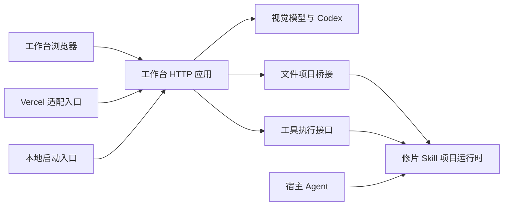

# 项目结构

帧好包含完整摄影工作台和两个 Agent Skill。工作台负责浏览器编辑、视觉顾问和本机项目协作；Skill 保持独立分发，使用宿主 Agent 的能力；FrameLark 插件将两套 Skill 组合为一次安装。

```text
FrameLark/
├── plugin.json                portable 插件清单
├── .codex-plugin/             Codex 兼容清单
├── .agents/plugins/           仓库插件市场
├── assets/                    插件小帧图标
├── apps/studio/
│   ├── public/                 浏览器界面、资源与图片处理模块
│   └── server/
│       ├── index.mjs           本地服务启动与关闭
│       ├── app.mjs             HTTP 请求处理；供本地与 Vercel 复用
│       ├── ai/                 模型协议、Codex 接入与组图审片
│       ├── projects/           文件项目路由与 Skill 项目桥接
│       └── tools/              修图工具执行接口
├── api/                        Vercel 函数适配入口
├── skills/
│   ├── photo-retouch/          修片 Skill、CLI、知识、独立暗房与引擎
│   └── photography-eye/        摄影眼 Skill 与知识检索
├── scripts/                    安装、质量评测和开发检查
├── test/                       Skill 与 Web 验证、授权样张
├── docs/                       架构、运行、设计和维护说明
│   └── images/                 品牌图板与 README 界面截图
└── .github/                    持续集成
```

## 入口与运行边界

| 入口 | 职责 |
| --- | --- |
| `npm start` / `npm run dev` | 运行 `apps/studio/server/index.mjs`，本机启动完整工作台 |
| `apps/studio/server/app.mjs` | 提供请求处理函数，导入时不监听端口 |
| `api/*.mjs` | Vercel 需要的薄适配层，复用工作台请求处理，不复制业务逻辑 |
| `npm run photo -- …` | 调用修片 Skill 的 CLI |
| `npm run install:skill` | 安装完整 `skills/photo-retouch` 目录 |
| `.agents/skills/photography-eye` | 指向摄影眼 Skill，供项目内 Agent 发现 |

运行配置、用户照片与项目目录按工作目录解析。浏览器静态资源、校验图和 Skill 运行时代码按源码位置解析；从其他目录启动也应正确找到资源。

Docker 和 Vercel 的根目录配置是平台入口。它们保留在根目录，业务源码集中在 `apps/studio`。根目录的 `package.json` 只负责稳定命令，完整 Web UI 仍可直接启动，无需安装前端构建依赖。

## 依赖关系



- 浏览器代码不依赖 Node 服务端；照片像素处理与临时预览在浏览器执行。
- 文件项目、候选事务、保护约束和审美审核记录由修片 Skill 的项目运行时管理，Web 通过桥接访问。
- Web 与 Skill 分发相同的像素和工具模块。`engine:check` 逐文件检查一致性，防止分发副本漂移；移动目录不能顺带改变处理结果。
- Skill 不依赖工作台目录，因此安装后的 CLI 和独立暗房仍能单独运行。

## 本次整理的判断

整理前，7 个服务端源码文件散落在根目录；应用入口混合 HTTP 处理与进程生命周期，文档截图与运行资源也混放在仓库入口。新能力持续直接追加文件，缺少稳定的模块归属和目录检查。

本次按应用和服务职责迁移源码、拆开启动入口、归拢截图，并同步运行、部署、测试和文档路径。用户编辑状态、模型配置、照片项目格式和像素管线沿用现有实现。

独立安装验证还发现：CLI 与知识检索从符号链接或 macOS 临时目录别名启动时，会因入口路径不一致而静默退出。入口比较已使用真实路径，增加了链接路径执行的回归检查。

仍需逐步改进：前端 `app.js` 同时协调多个流程；当前照片和照片列表仍手动同步部分状态；样式表存在历史覆盖层。后续应按导入、顾问、导出等流程拆分，配合实际浏览器验收；本次目录迁移不宣称已经解决这些内部耦合。

## 维护规则

新增运行代码先确定所属应用或 Skill；新增服务端能力放入工作台的对应服务目录。根目录用于项目入口与平台配置。修改路径后运行 `npm run architecture:check`，再检查共享引擎、测试、浏览器和部署。

领域术语见 [照片编辑领域](DOMAIN.md)，运行方式见 [部署说明](DEPLOYMENT.md)，修图工具契约见 [工具架构](PHOTO_TOOLS_ARCHITECTURE.md)。

## 迁移验收（2026-10-05）

- 根目录条目从 30 项收敛到 21 项；7 个服务端源码文件归入工作台应用。
- 本地完整测试 396 项通过，28 个共用像素/工具模块与 Skill 分发副本一致。
- 浏览器验证覆盖学习、偏好、风格、顾问、草稿恢复，以及工具勾选、蒙版预览、采纳与撤销；包含桌面与手机尺寸。
- Docker 隔离实例通过健康检查，首页、编辑脚本、处理线程、图片资源与工具目录可访问；镜像仓库网络超时后使用部署文档中的官方备用源完成验证。
- 修片 Skill 在临时目录实际安装，脱离仓库运行 CLI 与知识检查通过。验证使用测试样张与模拟模型，不作为新的画质或审美评测。
