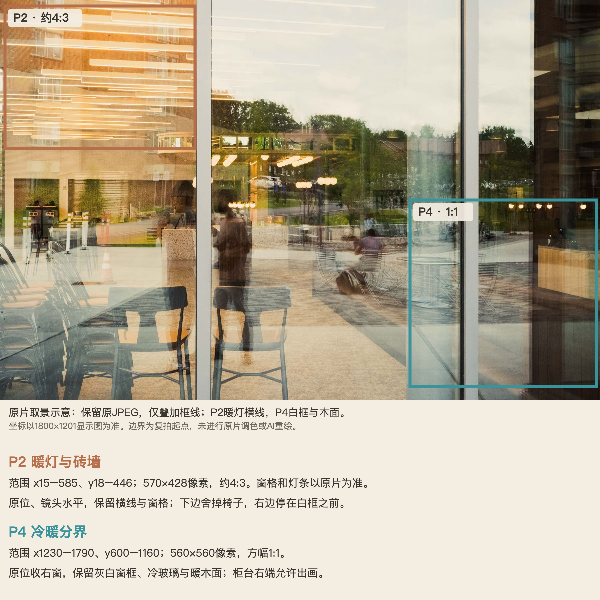

# 从输入到交付 · FrameLark 案例

案例展示用户给什么、怎样问、小帧交付什么。摄影眼的 AI 图板是拍法与精修目标；精修的真实版本和组图操作分别标明，不把它们都称为“修后照片”。

[返回 README](../README.md#使用示例) · [使用指南](USAGE.md) · [官网案例](https://tianfuwang.tech/FrameLark/examples.html) · 本地网站：`http://localhost:3177/examples.html`

## 光影拱廊 · 选定的 A 版式

**输入：**一张拱廊现场照，石拱、地面斜光与远处人物是可见抓手。示例输入来自 [Moises Caro / Pexels](https://www.pexels.com/photo/people-walking-on-the-hallway-13304171/)，采用 [Pexels License](https://www.pexels.com/license/)。下载工作图1800×2700，保留输入文件。

**提问：**“这里咋拍？”

**交付：**一张主推、四种候选，包含机位、对焦/曝光操作、后期方向与当前场景提醒。

2026-10-06 先用现场照完成拍法设计与参考板，再探索三个设计方向；用户选定 A「暖纸杂志」，本页采用用户再次附上的确切图片。设计探索引用了已有拍法板和固定 IP，因此这张是打磨后的展示例，不能称仅凭一个现场输入、一次从零生成的独立测评。另一次不提供版式参考的 Prompt 验证证明了设计方向可用，但字体、边距与小帧身份仍有漂移；当前 Skill 以设计 Prompt 为默认依据，固定 IP 单独引用。

图板1536×1024。生成的建筑纹理、人物与投影并非原片像素，P4边界等仍需检查。新视点待现场验证，实际精修仍交给用户原片。

## 咖啡馆玻璃倒影 · 独立首次交付

**输入：**[David Yu / Pexels](https://www.pexels.com/photo/reflection-of-cafe-in-window-9473089/) 的玻璃倒影照片，采用 [Pexels License](https://www.pexels.com/license/)。工作图1800×1201。

**提问：**“这里咋拍？”未给设备、地点、时间或偏好。

**执行：**独立子代理读取摄影眼0.1.3，实际看现场照与固定小帧 IP，没有读旧图板、旧提示词或父对话；无器材追问，调用一次生图生成整张板。工具输入是现场图＋固定IP，图板布局来自文字规范。

实际复核：P1仍保留抢眼站立人影；P2窗格与灯条被重绘；P3/P4方幅变横幅；P4窗框与木面关系有偏移；固定IP偏大。它是方向示例，不能称精确原片裁剪或已完成的实际精修。当前布局规则已调整为同排配对、边缘对齐，但此处保留首次结果，不改写旧试验。

P2/P4的准确原位边界以未改原片上的框示为依据：

## 精修与组图 · 真实操作截图

- **精修输入：**内置 `alpine-demo.png`。输出图展示0.1.1暗房里已有“晨光 · 轻调人物”保存版本与原片对照；本轮没有重新调用模型或执行精修，截图不证明任何新请求已经完成。
- **组图输入：**猫与咖啡两张CC0样片。猫咪由 Stefan van der Walt 提供；咖啡由 Rachel Michetti / Pikolo Espresso Bar 提供，来源为 [scikit-image 示例数据](https://scikit-image.org/docs/stable/api/skimage.data.html)。输出图是“安静日常”的实际组图空间，展示表达、顺序与逐张精调；不是已完成的九宫格。

截图日期、操作和其他来源见 [界面截图](SCREENSHOTS.md)。网页案例复用这些原始文件，只调整展示布局，没有重新生成照片。官网首页导航、摄影眼展示区与在线工作台均提供案例入口；本地工作台可从“看看创作案例”进入。页面展示已有案例，摄影眼在宿主 Skill 中使用。官网发布复用本地案例页与图片源文件，避免两份内容分别维护。
